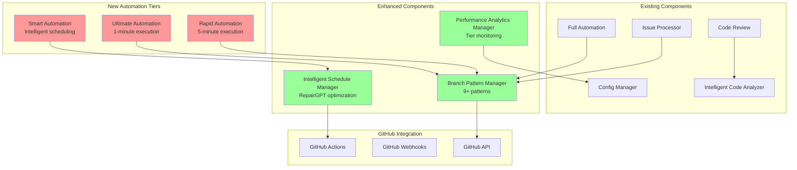

# Design Document

## Overview

This design document outlines the implementation of missing automation tiers and enhanced branch naming patterns for the Claude Smart Automation System. The system currently operates at 82% specification compliance, with key gaps in automation tier coverage (3/6 implemented) and branch naming pattern support (3/9+ implemented). This enhancement will complete the system to achieve full specification compliance while maintaining backward compatibility with existing implementations.

The design leverages the existing robust architecture including the ConfigManager, IntelligentCodeAnalyzer, and GitHub Actions integration, extending them with new automation tiers and intelligent branch pattern detection.

## Architecture

### High-Level Architecture



### Component Integration

The new components integrate seamlessly with existing architecture:

1. **New Automation Tiers** extend the existing workflow pattern
2. **Branch Pattern Manager** enhances existing branch creation logic
3. **Intelligent Schedule Manager** optimizes execution timing
4. **Performance Analytics Manager** provides comprehensive monitoring

## Components and Interfaces

### 1. Ultimate Automation Tier

**Purpose**: Highest performance automation with 1-minute execution cycles

**Interface**:
```yaml
# .github/workflows/claude-ultimate-automation.yml
name: Claude Ultimate Automation
on:
  schedule:
    - cron: '* * * * *'  # Every minute
  workflow_dispatch:
    inputs:
      force_execution:
        description: 'Force execution regardless of conditions'
        type: boolean
        default: false

jobs:
  ultimate-automation:
    runs-on: ubuntu-latest
    timeout-minutes: 1
    permissions:
      contents: write
      pull-requests: write
      issues: write
```

**Key Features**:
- Sub-minute processing target (45 seconds)
- Optimized for simple bugfixes and critical issues
- Automatic fallback to Rapid tier if timeout exceeded
- Priority-based issue selection
- Minimal quality checks for speed

### 2. Rapid Automation Tier

**Purpose**: Fast automation with 5-minute execution cycles

**Interface**:
```yaml
# .github/workflows/claude-rapid-automation.yml
name: Claude Rapid Automation
on:
  schedule:
    - cron: '*/5 * * * *'  # Every 5 minutes
  workflow_dispatch:

jobs:
  rapid-automation:
    runs-on: ubuntu-latest
    timeout-minutes: 5
    permissions:
      contents: write
      pull-requests: write
      issues: write
```

**Key Features**:
- 5-minute processing target
- Balanced speed vs quality approach
- Enhanced branch pattern detection
- Streamlined quality checks
- Automatic escalation for complex issues

### 3. Smart Automation Tier

**Purpose**: Intelligent scheduling with RepairGPT optimization

**Interface**:
```yaml
# .github/workflows/claude-smart-automation.yml
name: Claude Smart Automation
on:
  schedule:
    # RepairGPT optimized schedule
    - cron: '0 14,17,20 * * 1-5'  # Weekdays: 2PM, 5PM, 8PM UTC
    - cron: '0 1,5,9,13 * * 0,6'   # Weekends: 1AM, 5AM, 9AM, 1PM UTC
  workflow_dispatch:

jobs:
  smart-automation:
    runs-on: ubuntu-latest
    timeout-minutes: 60
    permissions:
      contents: write
      pull-requests: write
      issues: write
```

**Key Features**:
- Timezone-optimized scheduling
- Repository activity pattern analysis
- Resource usage optimization
- Comprehensive quality checks
- Learning-based improvement

### 4. Branch Pattern Manager

**Purpose**: Enhanced branch naming pattern detection and creation

**Interface**:
```javascript
class BranchPatternManager {
  constructor(config) {
    this.patterns = [
      'issue-{number}',           // Standard: issue-123
      'claude-{number}',          // Claude: claude-123
      'feature/issue-{number}',   // Feature: feature/issue-123
      'fix/issue-{number}',       // Fix: fix/issue-123
      'hotfix/issue-{number}',    // Hotfix: hotfix/issue-123
      'claude/issue-{number}',    // Claude namespace: claude/issue-123
      'automation-{number}',      // Automation: automation-123
      'security/issue-{number}',  // Security: security/issue-123
      'enhancement/issue-{number}' // Enhancement: enhancement/issue-123
    ];
  }

  selectOptimalPattern(issue, analysis) {
    // Pattern selection logic based on issue type and priority
  }

  createBranch(pattern, issueNumber, metadata) {
    // Branch creation with validation and sanitization
  }

  detectExistingBranches(issueNumber) {
    // Multi-pattern branch detection
  }
}
```

**Key Features**:
- 9+ branch naming patterns
- Intelligent pattern selection based on issue type
- Automatic pattern detection for existing branches
- Configurable custom patterns
- Branch name validation and sanitization

### 5. Intelligent Schedule Manager

**Purpose**: RepairGPT-inspired scheduling optimization

**Interface**:
```javascript
class IntelligentScheduleManager {
  constructor(config) {
    this.schedules = {
      ultimate: { interval: 60000, maxExecutionTime: 45000 },
      rapid: { interval: 300000, maxExecutionTime: 240000 },
      smart: { 
        weekdaySchedule: ['14:00', '17:00', '20:00'],
        weekendSchedule: ['01:00', '05:00', '09:00', '13:00'],
        timezone: 'UTC'
      }
    };
  }

  optimizeScheduling(repositoryActivity, resourceUsage) {
    // Dynamic schedule optimization
  }

  calculateNextExecution(tier, currentLoad) {
    // Next execution time calculation
  }

  preventResourceContention(activeTiers) {
    // Resource conflict prevention
  }
}
```

**Key Features**:
- RepairGPT-optimized time slots
- Repository activity pattern analysis
- Dynamic schedule adjustment
- Resource contention prevention
- Timezone-aware scheduling

### 6. Performance Analytics Manager

**Purpose**: Comprehensive monitoring and analytics for all automation tiers

**Interface**:
```javascript
class PerformanceAnalyticsManager {
  constructor(configManager) {
    this.config = configManager;
    this.metrics = {
      tierPerformance: {},
      resourceUsage: {},
      successRates: {},
      executionTimes: {}
    };
  }

  trackTierExecution(tier, startTime, endTime, success, metadata) {
    // Track individual tier execution
  }

  generatePerformanceReport() {
    // Comprehensive performance analysis
  }

  recommendTierOptimization() {
    // AI-driven tier selection recommendations
  }

  detectPerformanceAnomalies() {
    // Anomaly detection and alerting
  }
}
```

**Key Features**:
- Real-time performance tracking
- Tier comparison analytics
- Resource usage optimization
- Anomaly detection and alerting
- AI-driven recommendations

## Data Models

### Automation Tier Configuration

```javascript
const AutomationTierConfig = {
  ultimate: {
    name: 'Ultimate Automation',
    schedule: '* * * * *',
    maxExecutionTime: 45000,
    priority: 1,
    features: {
      branchPatterns: ['claude-{number}', 'fix/issue-{number}'],
      qualityChecks: ['security', 'syntax'],
      autoMerge: true,
      fallbackTier: 'rapid'
    }
  },
  rapid: {
    name: 'Rapid Automation',
    schedule: '*/5 * * * *',
    maxExecutionTime: 240000,
    priority: 2,
    features: {
      branchPatterns: ['issue-{number}', 'feature/issue-{number}', 'fix/issue-{number}'],
      qualityChecks: ['security', 'syntax', 'performance'],
      autoMerge: true,
      fallbackTier: 'smart'
    }
  },
  smart: {
    name: 'Smart Automation',
    schedule: {
      weekdays: ['14:00', '17:00', '20:00'],
      weekends: ['01:00', '05:00', '09:00', '13:00']
    },
    maxExecutionTime: 3600000,
    priority: 3,
    features: {
      branchPatterns: 'all',
      qualityChecks: 'comprehensive',
      autoMerge: false,
      createPR: true
    }
  }
};
```

### Branch Pattern Configuration

```javascript
const BranchPatternConfig = {
  patterns: [
    {
      name: 'standard',
      template: 'issue-{number}',
      priority: 1,
      conditions: ['type:any']
    },
    {
      name: 'claude',
      template: 'claude-{number}',
      priority: 2,
      conditions: ['automated:true']
    },
    {
      name: 'feature',
      template: 'feature/issue-{number}',
      priority: 3,
      conditions: ['type:feature', 'type:enhancement']
    },
    {
      name: 'fix',
      template: 'fix/issue-{number}',
      priority: 4,
      conditions: ['type:bug', 'type:bugfix']
    },
    {
      name: 'hotfix',
      template: 'hotfix/issue-{number}',
      priority: 5,
      conditions: ['priority:critical', 'priority:urgent']
    },
    {
      name: 'security',
      template: 'security/issue-{number}',
      priority: 6,
      conditions: ['label:security', 'type:security']
    }
  ],
  customPatterns: [],
  validation: {
    maxLength: 100,
    allowedChars: /^[a-zA-Z0-9\-_\/]+$/,
    reservedNames: ['main', 'master', 'develop', 'staging']
  }
};
```

### Performance Metrics Schema

```javascript
const PerformanceMetrics = {
  timestamp: Date,
  tier: String,
  execution: {
    startTime: Date,
    endTime: Date,
    duration: Number,
    success: Boolean,
    error: String
  },
  issue: {
    number: Number,
    type: String,
    priority: String,
    complexity: String
  },
  resources: {
    githubActionsMinutes: Number,
    apiCalls: Number,
    memoryUsage: Number
  },
  quality: {
    checksPerformed: Array,
    issuesFound: Number,
    securityScore: Number,
    performanceScore: Number
  },
  outcome: {
    branchCreated: String,
    prCreated: Boolean,
    autoMerged: Boolean,
    fallbackUsed: Boolean
  }
};
```

## Error Handling

### Tier Execution Error Handling

```javascript
class TierExecutionHandler {
  async executeTier(tier, issue) {
    try {
      const result = await this.runTierLogic(tier, issue);
      await this.recordSuccess(tier, result);
      return result;
    } catch (error) {
      await this.handleTierError(tier, issue, error);
      throw error;
    }
  }

  async handleTierError(tier, issue, error) {
    // Log error with context
    console.error(`❌ ${tier} execution failed for issue #${issue.number}:`, error);

    // Record failure metrics
    await this.recordFailure(tier, issue, error);

    // Attempt fallback if configured
    const fallbackTier = this.config.getTierFallback(tier);
    if (fallbackTier && this.shouldAttemptFallback(error)) {
      console.log(`🔄 Attempting fallback to ${fallbackTier}`);
      try {
        return await this.executeTier(fallbackTier, issue);
      } catch (fallbackError) {
        console.error(`❌ Fallback to ${fallbackTier} also failed:`, fallbackError);
      }
    }

    // Notify administrators for critical failures
    if (this.isCriticalError(error)) {
      await this.notifyAdministrators(tier, issue, error);
    }
  }

  shouldAttemptFallback(error) {
    const fallbackableErrors = [
      'TIMEOUT',
      'RATE_LIMIT_EXCEEDED',
      'TEMPORARY_API_ERROR',
      'RESOURCE_EXHAUSTED'
    ];
    return fallbackableErrors.includes(error.code);
  }

  isCriticalError(error) {
    const criticalErrors = [
      'AUTHENTICATION_FAILED',
      'PERMISSION_DENIED',
      'SYSTEM_FAILURE'
    ];
    return criticalErrors.includes(error.code);
  }
}
```

### Branch Pattern Error Handling

```javascript
class BranchPatternErrorHandler {
  async createBranchWithFallback(patterns, issueNumber, metadata) {
    for (const pattern of patterns) {
      try {
        const branchName = this.generateBranchName(pattern, issueNumber, metadata);
        await this.validateBranchName(branchName);
        await this.createBranch(branchName);
        return branchName;
      } catch (error) {
        console.warn(`⚠️ Pattern ${pattern} failed: ${error.message}`);
        continue;
      }
    }
    
    // Final fallback to simple pattern
    const fallbackName = `claude-fallback-${issueNumber}-${Date.now()}`;
    await this.createBranch(fallbackName);
    return fallbackName;
  }

  async validateBranchName(branchName) {
    if (!branchName || branchName.length > 100) {
      throw new Error('Invalid branch name length');
    }
    
    if (!/^[a-zA-Z0-9\-_\/]+$/.test(branchName)) {
      throw new Error('Invalid characters in branch name');
    }
    
    if (await this.branchExists(branchName)) {
      throw new Error('Branch already exists');
    }
  }
}
```

## Testing Strategy

### Unit Testing

```javascript
// Test automation tier execution
describe('AutomationTierManager', () => {
  test('Ultimate tier completes within 45 seconds', async () => {
    const startTime = Date.now();
    const result = await tierManager.executeUltimate(mockIssue);
    const duration = Date.now() - startTime;
    
    expect(duration).toBeLessThan(45000);
    expect(result.success).toBe(true);
  });

  test('Rapid tier handles medium complexity issues', async () => {
    const mediumIssue = createMockIssue({ complexity: 'medium' });
    const result = await tierManager.executeRapid(mediumIssue);
    
    expect(result.success).toBe(true);
    expect(result.qualityChecks).toContain('security');
    expect(result.qualityChecks).toContain('performance');
  });

  test('Smart tier uses optimal scheduling', async () => {
    const schedule = scheduleManager.getOptimalSchedule('smart');
    
    expect(schedule.weekdays).toEqual(['14:00', '17:00', '20:00']);
    expect(schedule.weekends).toEqual(['01:00', '05:00', '09:00', '13:00']);
  });
});

// Test branch pattern selection
describe('BranchPatternManager', () => {
  test('Selects appropriate pattern for bug issues', () => {
    const bugIssue = createMockIssue({ type: 'bug', priority: 'high' });
    const pattern = patternManager.selectOptimalPattern(bugIssue);
    
    expect(pattern).toBe('fix/issue-{number}');
  });

  test('Handles security issues with security pattern', () => {
    const securityIssue = createMockIssue({ labels: ['security'] });
    const pattern = patternManager.selectOptimalPattern(securityIssue);
    
    expect(pattern).toBe('security/issue-{number}');
  });

  test('Falls back to standard pattern when no specific match', () => {
    const genericIssue = createMockIssue({ type: 'unknown' });
    const pattern = patternManager.selectOptimalPattern(genericIssue);
    
    expect(pattern).toBe('issue-{number}');
  });
});
```

### Integration Testing

```javascript
// Test complete automation flow
describe('Complete Automation Flow', () => {
  test('Ultimate automation processes simple issue end-to-end', async () => {
    const issue = await createTestIssue({
      title: 'Fix simple bug in validation',
      labels: ['bug', 'claude-ready'],
      priority: 'medium'
    });

    const result = await automationEngine.processIssue(issue, 'ultimate');

    expect(result.success).toBe(true);
    expect(result.branchCreated).toMatch(/^fix\/issue-\d+$/);
    expect(result.executionTime).toBeLessThan(45000);
    expect(result.autoMerged).toBe(true);
  });

  test('Smart automation handles complex feature request', async () => {
    const issue = await createTestIssue({
      title: 'Add new authentication system',
      labels: ['feature', 'enhancement'],
      priority: 'high'
    });

    const result = await automationEngine.processIssue(issue, 'smart');

    expect(result.success).toBe(true);
    expect(result.branchCreated).toMatch(/^feature\/issue-\d+$/);
    expect(result.prCreated).toBe(true);
    expect(result.autoMerged).toBe(false);
  });
});

// Test performance requirements
describe('Performance Requirements', () => {
  test('All tiers meet their execution time targets', async () => {
    const testIssues = await createTestIssues(10);
    
    for (const tier of ['ultimate', 'rapid', 'smart']) {
      const results = await Promise.all(
        testIssues.map(issue => automationEngine.processIssue(issue, tier))
      );
      
      const avgExecutionTime = results.reduce((sum, r) => sum + r.executionTime, 0) / results.length;
      const maxExecutionTime = tierConfig[tier].maxExecutionTime;
      
      expect(avgExecutionTime).toBeLessThan(maxExecutionTime);
    }
  });
});
```

### Load Testing

```javascript
// Test concurrent execution
describe('Load Testing', () => {
  test('System handles multiple concurrent tier executions', async () => {
    const concurrentIssues = await createTestIssues(20);
    
    const promises = concurrentIssues.map((issue, index) => {
      const tier = ['ultimate', 'rapid', 'smart'][index % 3];
      return automationEngine.processIssue(issue, tier);
    });

    const results = await Promise.all(promises);
    const successRate = results.filter(r => r.success).length / results.length;
    
    expect(successRate).toBeGreaterThan(0.95); // 95% success rate
  });

  test('GitHub Actions quota management', async () => {
    const quotaManager = new GitHubActionsQuotaManager();
    
    // Simulate heavy usage
    for (let i = 0; i < 100; i++) {
      await quotaManager.trackUsage('ultimate', 45);
    }
    
    const usage = quotaManager.getCurrentUsage();
    expect(usage.remainingMinutes).toBeGreaterThan(0);
    expect(usage.quotaExceeded).toBe(false);
  });
});
```

This comprehensive design provides a robust foundation for implementing the missing automation tiers and enhanced branch naming patterns while maintaining the high quality and security standards of the existing system.