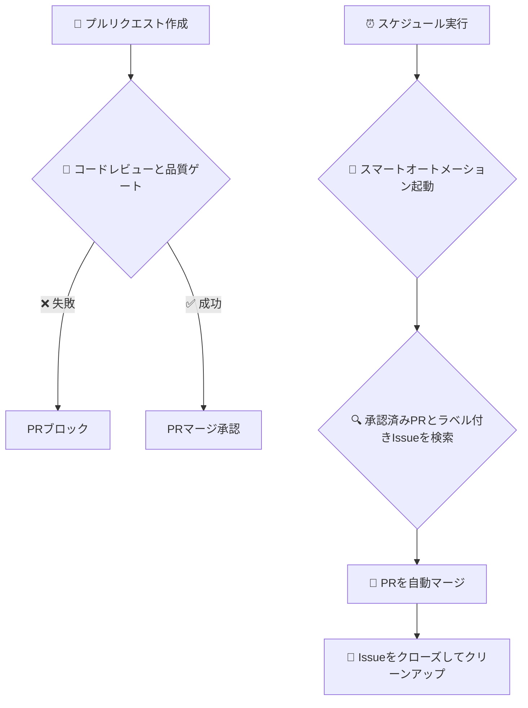

# Claudeスマート自動化システム

[](https://opensource.org/licenses/MIT)

**GitHubのIssueを、マージ済みのプルリクエストに自動で変換します。**

このシステムは、Issueの検知からブランチのクリーンアップまで、開発サイクル全体を自動化する完全なハンズオフワークフローを提供します。AIによるコードレビューと品質ゲートも組み込まれています。

---

### ワークフロー図



---

## ✨ このシステムの利点

-   **効率を最大化**: PRの作成、マージ、クリーンアップといった反復的なタスクを自動化します。AIが手作業を代行するため、あなたはコーディングに集中できます。
-   **品質を確保**: すべてのプルリクエストで品質ゲートとAIによるコードレビューを自動的に実行し、問題を早期に発見して高いコード標準を維持します。
-   **一貫性を確保**: コード統合のための一貫したエラーのないワークフローで、開発プロセスを標準化します。
-   **本番環境に対応**: 明確で保守性の高いワークフローを備えた、堅牢な本番グレードの自動化システムです。

## 🚀 3ステップで開始

### ステップ1: ワークフローのコピー

このリポジトリの `.github/workflows` ディレクトリから、あなたのプロジェクトの `.github/workflows` ディレクトリに2つのワークフローファイルをコピーします。

1.  `claude-smart-automation.yml`
2.  `claude-code-review.yml`

### ステップ2: シークレットの設定

リポジトリの `Settings > Secrets and variables > Actions` に移動し、以下のシークレットを追加します。

-   `GITHUB_TOKEN`: `repo` と `workflow` スコープを持つGitHubトークン。ほとんどの操作では、デフォルトの `secrets.GITHUB_TOKEN` で動作します。
-   `CLAUDE_API_KEY`: Claude AIモデルのAPIキー。

### ステップ3: 動作確認

1.  **Issueを作成**し、`claude-ready` ラベルを追加します。
    ```bash
    gh issue create --title "新機能の追加" --body "議論した通りに機能実装をお願いします。" --label "claude-ready"
    # Issue番号（例: #1）をメモしておきます
    ```

2.  **ブランチを作成して変更をプッシュ**します。ブランチ名にはIssue番号を含める必要があります（例: `feature/issue-1`）。
    ```bash
    git checkout -b feature/issue-1
    echo "新機能" > new-feature.txt
    git add .
    git commit -m "feat: #1 のための新機能実装"
    git push --set-upstream origin feature/issue-1
    ```

3.  **プルリクエストを作成**します。
    ```bash
    gh pr create --title "feat: 新機能の実装" --body "Closes #1"
    ```

**これで完了です！** システムは以下の動作を自動的に行います。
1.  あなたのPRで**コードレビューと品質ゲート**を実行します。
2.  次回のスケジュール実行時に、**スマートオートメーション**ワークフローがPRをマージし、Issueをクローズして、ブランチを削除します。

---

## 🔍 ワークフローの内訳

このリポジトリは、2つのコアワークフローを使用して自動化プロセスを管理します。

### 1. `claude-code-review.yml` (コードレビューと品質ゲート)

-   **トリガー**: プルリクエストがオープンまたは更新されたときに実行されます。
-   **目的**: コードの品質を保証するゲートキーパーとして機能します。
-   **ジョブ**:
    -   **品質ゲート**: PRのサイズやハードコードされたシークレットの有無など、基本的なチェックを実行します。重大な問題が見つかった場合、PRをブロックします。
    -   **AIレビュー**: 品質ゲートを通過すると、このジョブが `npm run cli review` コマンドを実行してAIによるコード分析を行い、結果をコメントとして投稿します。

### 2. `claude-smart-automation.yml` (スマートオートメーション)

-   **トリガー**: スケジュール（平日夜、土日昼）または手動で実行されます。
-   **目的**: 開発ライフサイクルを自動化するメインエンジンです。
-   **プロセス**:
    1.  `claude-ready` などのラベルが付いたオープンなIssueを検索します。
    2.  各Issueに対応するブランチを見つけます。
    3.  プルリクエストが存在しない場合は作成します。
    4.  PRが必要なステータスチェック（品質ゲートを含む）をすべてパスしたか確認します。
    5.  PRをマージし、Issueをクローズして、ブランチを削除します。

## 🤝 コントリビューション

コントリビューションを歓迎します！プルリクエストの送信、バグ報告、機能提案の方法については、[**コントリビューションガイド**](CONTRIBUTING.md)をご覧ください。

## 📄 ライセンス

このプロジェクトは[MITライセンス](LICENSE)の下でライセンスされています。
