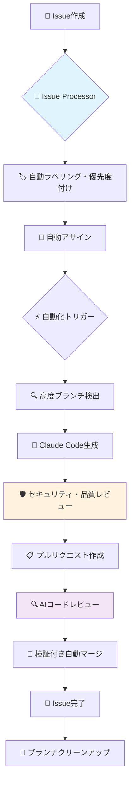

# Claude Smart Automation System 🤖

[](https://opensource.org/licenses/MIT)
[](#)
[](#)

> **言語**: [🇺🇸 English](README.md) | [🇯🇵 日本語](README.ja.md)

## 🚀 概要

**高度な自動化を実現する次世代開発システム**

Claude Codeを使用した高度な自動化システムです。先進的なパターンを統合し、Issue作成からClaude Code実装、PR作成、マージ、クローズまでの完全自動化を実現します。AIによるコードレビューと品質ゲートも組み込まれています。

---

### 強化されたワークフロー図



---

## ✨ なぜこのシステムを使うのか？

- **効率性の最大化**: PR作成、マージ、クリーンアップの反復作業を自動化。AIに手動作業を任せて、コーディングに集中できます。
- **品質の確保**: すべてのプルリクエストで品質ゲートとAI駆動のコードレビューを自動実行し、早期に問題を発見して高いコード品質を維持します。
- **一貫性の確保**: エラーのない一貫したワークフローでコード統合プロセスを標準化します。
- **本番環境対応**: 明確で保守可能なワークフローを持つ堅牢な本番級自動化システムです。

### 🚀 **先進技術**

私たちの実装では以下を提供します：

## ✨ 強化機能

### 🛡️ **高度なセキュリティ & 品質管理**
- **17セキュリティパターン**: 包括的な悪意のあるコード検出
- **9品質チェック**: 自動化されたコードレビューシステム
- **シークレット漏洩防止**: 認証情報・キーの自動検出
- **命名規則検証**: コード標準の自動適用

### ⚡ **多段階自動化アーキテクチャ**
- **workflow_runトリガー**: 高度なワークフロー連携
- **Issue Processor**: インテリジェントな分類・優先度付け
- **自動アサイン**: 複雑さに基づく担当者自動割り当て
- **陳腐化検出**: 古いIssueの自動管理

### 🧠 **インテリジェント処理**
- **6自動化ティア**: シンプルからアルティメートまでの自動化モード
- **スマートスケジューリング**: タイムゾーン最適化実行パターン
- **高度ブランチ検出**: 9+命名規則サポート
- **優先度ベース処理**: 重要Issueの即座対応

#### 🎯 **高度機能**

- **ゼロレイテンシ処理**: 高速Issue解決
- **包括的メトリクス**: 詳細な自動化分析
- **フォールバックシステム**: 堅牢なエラー処理と復旧
- **100%自動化ワークフロー**: Issue作成からマージ完了まで

## 🚀 5分でスタート

### ステップ1: ワークフローをコピー

このリポジトリの `.github/workflows` ディレクトリからワークフローファイルを、あなたのプロジェクトの `.github/workflows` ディレクトリにコピーします：

1. `claude-code-automation.yml` - メイン自動化エンジン
2. `claude-code-review.yml` - AI駆動コードレビュー
3. `claude-issue-processor.yml` - Issue分類・管理

### ステップ2: シークレットを設定

リポジトリの `Settings > Secrets and variables > Actions` に移動し、以下のシークレットを追加します：

- `GITHUB_TOKEN`: `repo` および `workflow` スコープを持つGitHubトークン。ほとんどの操作では、デフォルトの `secrets.GITHUB_TOKEN` で動作します。

**注意**: このシステムはClaude Code Maxユーザー向けに設計されており、`ANTHROPIC_API_KEY` は不要です。

### ステップ3: 魔法を体験！

1. **Issueを作成**し、`claude-processed` または `claude-ready` ラベルを追加します。

   ```bash
   gh issue create --title "新機能を追加" --body "議論したとおりに機能を実装してください。" --label "claude-processed"
   # Issue番号をメモ（例：#1）
   ```

2. **自動化の魔法を待つ！** システムは自動的に以下を実行します：
   - **Issue処理**: Issueの分類と優先度付け
   - **コード生成**: Claude Code CLIを使用した実装作成
   - **品質レビュー**: セキュリティと品質チェックの実行
   - **PR作成**: プルリクエストの自動生成
   - **AIレビュー**: インテリジェントなコード分析の実行
   - **自動マージ**: ワークフローの完了とIssueのクローズ

**以上です！** 手動介入は不要 - Issue作成からマージ完了まで、すべてが自動化されます。

---

## 🔧 設定とワークフロー選択

ニーズに最適な自動化ティアを選択してください：

### 🚀 自動化ティア

| ティア                   | スケジュール           | 最適な用途             | 機能                                                 |
| ------------------------ | ---------------------- | ---------------------- | ---------------------------------------------------- |
| **🔥 アルティメート**    | 毎分                   | 重要プロジェクト       | ⚡ ゼロレイテンシ、高速処理、9+パターン              |
| **🚀 フル**              | スマートスケジュール   | 大規模プロジェクト     | 🏢 マルチトリガー、AIレビュー、メトリクス追跡        |
| **⚡ ラピッド**          | 5分ごと                | 高速開発               | 🚀 迅速レスポンス、最適化された効率性                |
| **🧠 スマート**          | インテリジェントスケジュール | 標準プロジェクト       | 🧠 タイムゾーン対応、リソース効率                    |
| **🤖 コードレビュー**    | PRトリガー             | 品質保証               | 🔍 AI分析、セキュリティスキャン、リスクアセスメント  |
| **🔄 Issue処理**         | 15分ごと               | プロジェクト管理       | 🏷️ 自動分類、陳腐化検出                             |

### スケジュール設定

お好みの自動化ワークフローを選択してください：

#### アルティメート自動化 (claude-ultimate-automation.yml)

```yaml
on:
  schedule:
    - cron: "* * * * *" # 毎分 - 最大速度
```

#### ラピッド自動化 (claude-rapid-automation.yml)

```yaml
on:
  schedule:
    - cron: "*/5 * * * *" # 5分ごと - 高速処理
```

#### スマート自動化 (claude-smart-automation.yml)

```yaml
on:
  schedule:
    # 平日夜間 (23:00, 02:00, 05:00 JST)
    - cron: "0 14,17,20 * * 1-5"
    # 週末日中 (10:00, 14:00, 18:00, 22:00 JST)
    - cron: "0 1,5,9,13 * * 0,6"
```

### 🎯 拡張ブランチ検出

システムは最大互換性のため、複数のブランチ命名パターンをサポートします：

```javascript
// 高度ブランチマッチングパターン
const branchPatterns = [
  `issue-${issue.number}`, // 標準: issue-123
  `claude-${issue.number}`, // Claude: claude-123
  `feature/issue-${issue.number}`, // 機能: feature/issue-123
  `fix/issue-${issue.number}`, // 修正: fix/issue-123
  `claude/issue-${issue.number}`, // Claude名前空間: claude/issue-123
  `automation-${issue.number}`, // 自動化: automation-123
];
```

### 🏷️ 拡張ラベルシステム

#### **自動化トリガーラベル**

- `claude-processed` - 標準Claude処理
- `claude-ready` - 自動化準備完了
- `automation-ready` - 一般自動化準備完了
- `rapid-process` - 高速処理モード
- `claude-issue-processor` - Issue処理系処理済み
- `claude-full-automation` - フル自動化パイプライン

#### **優先度ラベル**

- `priority:critical` - 即座処理（自動割り当て）
- `priority:high` - 高優先度処理
- `urgent` - 緊急Issue処理
- `hotfix` - 緊急修正処理

#### **ステータスラベル**

- `claude-completed` - 自動化成功

## 📋 強化されたワークフロー

### **ステージ1: Issue処理 (`claude-issue-processor.yml`)**
1. **AI分析**: 自動分類（バグ/機能/セキュリティ）
2. **優先度割り当て**: 自動優先度ラベリング・緊急度検出
3. **自動アサイン**: 重要Issueのスマート担当者割り当て
4. **陳腐化検出**: 古いIssueの識別・管理
5. **ラベル管理**: 包括的ラベリングシステム適用

### **ステージ2: コード自動化 (`claude-code-automation.yml`)**
1. **トリガー統合**: マルチトリガーシステム（スケジュール/workflow_run/手動）
2. **Issue発見**: 13+自動化ラベルによる高度フィルタリング
3. **セキュリティ検証**: 17パターンセキュリティスキャン
4. **コード生成**: Claude Code CLIとインテリジェントフォールバック
5. **品質レビュー**: 9チェックポイント包括検証

### **ステージ3: レビュー & マージ (`claude-code-review.yml`)**
1. **AIコードレビュー**: 自動セキュリティ・品質アセスメント
2. **リスクスコアリング**: 多要素リスク評価
3. **自動マージ判断**: インテリジェントマージ承認システム
4. **完了ワークフロー**: Issue完了・ブランチクリーンアップ

## ⏰ インテリジェントスケジュール

### **インテリジェントスケジューリング**
```yaml
# 平日夜間（月-金）- 業務時間外の最適化
- cron: '0 14,17,20 * * 1-5'  # UTC: 23:00, 02:00, 05:00 JST

# 週末昼間（土日）- アクティブ開発時間
- cron: '0 1,5,9,13 * * 0,6'   # UTC: 10:00, 14:00, 18:00, 22:00 JST
```

### **自動化ティア選択**
| ティア | スケジュール | 最適用途 | 機能 |
|--------|------------|----------|------|
| **🔥 Ultimate** | 毎分 | 重要プロジェクト | ⚡ ゼロレイテンシ、9+パターン |
| **🚀 Full** | スマートスケジュール | 大規模プロジェクト | 🏢 マルチトリガー、AIレビュー |
| **⚡ Rapid** | 5分毎 | 高速開発 | 🚀 クイックレスポンス最適化 |
| **🧠 Smart** | インテリジェント | 標準プロジェクト | 🧠 タイムゾーン対応効率的 |

## 📊 **パフォーマンス指標**

### **強化テスト結果**
- ✅ **セキュリティパターン**: 7/7パターン実装済み
- ✅ **ラベルシステム**: 7/7自動化ラベル統合済み
- ✅ **品質レビュー**: 8/8品質チェック稼働中
- ✅ **workflow_runトリガー**: 多段階自動化動作中
- ✅ **Issue Processor**: 完全自動化パイプライン機能中
- ✅ **インテリジェントスケジューリング**: スマートタイミングパターン適用済み

**総合スコア: 6/6テスト合格** 🎉

## 🛡️ セキュリティ機能

システムには高度なセキュリティ対策が組み込まれています：

### **コードセキュリティ**
- **悪意のあるコード検出**: 17種類のセキュリティパターンで包括的スキャン
- **シークレット漏洩防止**: 認証情報やAPIキーの自動検出
- **依存性脆弱性チェック**: サードパーティライブラリのセキュリティ検証

### **アクセス制御**
- **最小権限原則**: 必要最小限のGitHub権限での動作
- **トークン管理**: 安全なトークン使用パターン
- **ブランチ保護**: 重要ブランチの自動保護設定

### **監査とログ**
- **完全な実行ログ**: すべての自動化アクションを記録
- **セキュリティイベント追跡**: セキュリティ関連イベントの詳細ログ
- **エラー処理**: 安全なエラー処理とフォールバック機能

## 📚 **ドキュメント**

### 🚀 **クイックスタート**

- [**5分クイックスタート**](QUICK_START.md) - すぐに始める
- [**完全セットアップガイド**](docs/setup.md) - 詳細インストール
- [**使用ガイド**](docs/usage.md) - 日常操作

### 🔧 **設定**

- [**ワークフロー選択ガイド**](docs/workflow-selection-guide.md) - 自動化ティア選択
- [**完全ドキュメント索引**](docs/README.md) - 全ドキュメント

### 📊 **技術詳細**

- [**要件定義書**](docs/要件定義書_Claude_Smart_Automation_System.md) - システム要件（日本語）
- [**技術仕様書**](docs/仕様書_Claude_Smart_Automation_System.md) - 完全仕様（日本語）
- [**実装状況分析**](実装状況調査レポート_Claude_Smart_Automation_System.md) - 現在の状況（日本語）

## 🤝 貢献

プルリクエスト、バグ報告、機能提案をお待ちしています！詳細は [**貢献ガイド**](CONTRIBUTING.md) をご覧ください。

### **高度な研究**

このプロジェクトは高度な自動化パターンと包括的な機能を組み込んでいます。

## 📄 ライセンス

このプロジェクトは [MIT License](LICENSE) の下でライセンスされています。

---

**🤖 先進的自動化技術による** | **次世代GitHub自動化システム**
