# Claude Smart Automation System 🤖

[](https://opensource.org/licenses/MIT)
[](#)
[](docs/README.md)

> **Language**: [🇺🇸 English](README.md) | [🇯🇵 日本語](README.ja.md)

**Transform GitHub Issues into Merged Pull Requests, automatically.**

An AI-driven automation system that provides complete, hands-off workflow automation from issue detection to branch cleanup. Features advanced AI-powered code reviews, comprehensive security scanning, and intelligent quality gates.

---

### Enhanced Workflow Diagram

```mermaid
graph TD
    A[📝 Issue Created] --> B{🤖 Issue Processor};
    B --> C[🏷️ Auto-Labeling & Prioritization];
    C --> D[👤 Auto-Assignment];
    D --> E{⚡ Automation Triggered};
    E --> F[🔍 Advanced Branch Detection];
    F --> G[🤖 Claude Code Generation];
    G --> H[🛡️ Security & Quality Review];
    H --> I[📋 Create Pull Request];
    I --> J[🔍 AI Code Review];
    J --> K[🚀 Auto-Merge with Validation];
    K --> L[🎉 Issue Completion];
    L --> M[🧹 Branch Cleanup];

    style B fill:#e1f5fe
    style H fill:#fff3e0
    style J fill:#f3e5f5
```



---

## ✨ Why Use This System?

- **Maximize Efficiency**: Automate the repetitive tasks of PR creation, merging, and cleanup. Let the AI handle the manual work so you can focus on coding.
- **Ensure Quality**: Automatically run quality gates and AI-powered code reviews on every pull request to catch issues early and maintain high code standards.
- **Ensure Consistency**: Standardize your development process with a consistent, error-free workflow for code integration.
- **Production Ready**: A robust, production-grade automation system with clear, maintainable workflows.

### 🚀 **Advanced Technology**

Our implementation offers:

#### 🛡️ **Advanced Security & Quality**

- **17 Security Patterns**: Enhanced malicious code detection
- **9 Quality Checks**: Comprehensive code review automation
- **Secret Leakage Prevention**: Automatic detection of credentials/keys
- **Naming Convention Validation**: Enforced code standards

#### ⚡ **Multi-Stage Automation**

- **workflow_run Triggers**: Sophisticated workflow orchestration
- **Issue Processor**: Intelligent categorization and prioritization
- **Auto-Assignment**: Smart reviewer assignment based on complexity
- **Staleness Detection**: Automatic old issue management

#### 🧠 **Intelligent Processing**

- **6 Automation Tiers**: From Simple to Ultimate automation modes
- **Smart Scheduling**: Timezone-optimized execution patterns
- **Advanced Branch Detection**: 9+ naming convention support
- **Priority-Based Processing**: Critical issues get immediate attention

#### 🎯 **Advanced Features**

- **Zero Latency Processing**: Lightning-fast issue resolution
- **Comprehensive Metrics**: Detailed automation analytics
- **Fallback Systems**: Robust error handling and recovery
- **100% Automated Workflow**: From issue creation to merge completion

## 🚀 Get Started in 5 Minutes

### Step 1: Copy the Workflows

Copy the workflow files from this repository's `.github/workflows` directory into your own project's `.github/workflows` directory:

1.  `claude-code-automation.yml` - Main automation engine
2.  `claude-code-review.yml` - AI-powered code review
3.  `claude-issue-processor.yml` - Issue categorization and management

### Step 2: Configure Secrets

Go to your repository's `Settings > Secrets and variables > Actions` and add the following secrets:

- `GITHUB_TOKEN`: A GitHub token with `repo` and `workflow` scopes. The default `secrets.GITHUB_TOKEN` should work for most operations.

**Note**: This system is designed for Claude Code Max users and does not require an `ANTHROPIC_API_KEY`.

### Step 3: See the Magic Happen!

1.  **Create an issue** and add the `claude-processed` or `claude-ready` label to it.

    ```bash
    gh issue create --title "Add a new feature" --body "Implement the feature as discussed." --label "claude-processed"
    # Note the issue number (e.g., #1)
    ```

2.  **Wait for automation magic!** The system will automatically:
    - **Issue Processor**: Categorize and prioritize your issue
    - **Code Generation**: Create implementation using Claude Code CLI
    - **Quality Review**: Run security and quality checks
    - **PR Creation**: Generate pull request automatically
    - **AI Review**: Perform intelligent code analysis
    - **Auto-Merge**: Complete the workflow and close the issue

**That's it!** No manual intervention required - from issue creation to merge completion, everything is automated.

---

## 🔧 Configuration & Workflow Selection

Choose the automation tier that best fits your needs:

### 🚀 Automation Tiers

| Tier                   | Schedule             | Best For           | Features                                           |
| ---------------------- | -------------------- | ------------------ | -------------------------------------------------- |
| **🔥 Ultimate**        | Every minute         | Critical projects  | ⚡ Zero latency, lightning processing, 9+ patterns |
| **🚀 Full**            | Smart Schedule       | Large projects     | 🏢 Multi-trigger, AI review, metrics tracking      |
| **⚡ Rapid**           | Every 5 minutes      | Fast development   | 🚀 Quick response, optimized efficiency            |
| **🧠 Smart**           | Intelligent schedule | Standard projects  | 🧠 Timezone-aware, resource efficient              |
| **🤖 Code Review**     | PR-triggered         | Quality assurance  | 🔍 AI analysis, security scanning, risk assessment |
| **🔄 Issue Processor** | Every 15 minutes     | Project management | 🏷️ Auto-categorization, staleness detection        |

### Schedule Configuration

Choose your preferred automation workflow:

#### Ultimate Automation (claude-ultimate-automation.yml)

```yaml
on:
  schedule:
    - cron: "* * * * *" # Every minute - Maximum Speed
```

#### Rapid Automation (claude-rapid-automation.yml)

```yaml
on:
  schedule:
    - cron: "*/5 * * * *" # Every 5 minutes - Fast Processing
```

#### Smart Automation (claude-smart-automation.yml)

```yaml
on:
  schedule:
    # Weekday nights (23:00, 02:00, 05:00 JST)
    - cron: "0 14,17,20 * * 1-5"
    # Weekend days (10:00, 14:00, 18:00, 22:00 JST)
    - cron: "0 1,5,9,13 * * 0,6"
```

### 🎯 Enhanced Branch Detection

Our system now supports multiple branch naming patterns for maximum compatibility:

```javascript
// Advanced branch matching patterns
const branchPatterns = [
  `issue-${issue.number}`, // Standard: issue-123
  `claude-${issue.number}`, // Claude: claude-123
  `feature/issue-${issue.number}`, // Feature: feature/issue-123
  `fix/issue-${issue.number}`, // Fix: fix/issue-123
  `claude/issue-${issue.number}`, // Claude namespace: claude/issue-123
  `automation-${issue.number}`, // Automation: automation-123
];
```

### 🏷️ Enhanced Label System

#### **Automation Trigger Labels**

- `claude-processed` - Standard Claude processing
- `claude-ready` - Ready for automation
- `automation-ready` - General automation ready
- `rapid-process` - High-speed processing mode
- `claude-issue-processor` - Issue processor handled
- `claude-full-automation` - Full automation pipeline

#### **Priority Labels**

- `priority:critical` - Immediate processing (auto-assigned)
- `priority:high` - High priority processing
- `urgent` - Urgent issue handling
- `hotfix` - Emergency fix processing

#### **Status Labels**

- `claude-completed` - Successfully automated
- `automation-failed` - Requires manual intervention
- `stale` - Old issue detection
- `manual-only` - Skip automation

#### **Quality Labels**

- `security-review` - Security-focused review
- `needs-tests` - Test requirement
- `complexity:high` - Complex issue marking

## 🔍 Enhanced Workflow Breakdown

### **Stage 1: Issue Processing (`claude-issue-processor.yml`)**

1. **Issue Analysis**: AI-powered categorization (bug/feature/security)
2. **Priority Assignment**: Automatic priority labeling and urgency detection
3. **Auto-Assignment**: Smart reviewer assignment for critical issues
4. **Staleness Detection**: Identification and management of old issues
5. **Label Management**: Comprehensive labeling system application

### **Stage 2: Code Automation (`claude-code-automation.yml`)**

1. **Trigger Integration**: Multi-trigger system (schedule/workflow_run/manual)
2. **Issue Discovery**: Advanced filtering with 13+ automation labels
3. **Security Validation**: 17-pattern security scanning
4. **Code Generation**: Claude Code CLI with intelligent fallback
5. **Quality Review**: 9-checkpoint comprehensive validation

### **Stage 3: Review & Merge (`claude-code-review.yml`)**

1. **AI Code Review**: Automated security and quality assessment
2. **Risk Scoring**: Multi-factor risk evaluation
3. **Auto-Merge Decision**: Intelligent merge approval system
4. **Completion Workflow**: Issue closure and branch cleanup

### **🛡️ Security Features**

- **Malicious Code Detection**: 17 security patterns
- **Secret Leakage Prevention**: Credential scanning
- **Input Sanitization**: Branch name and content validation
- **Quality Thresholds**: Minimum code standards enforcement

## 📊 **Performance Metrics**

### **Enhancement Test Results**

- ✅ **Security Patterns**: 7/7 patterns implemented
- ✅ **Label System**: 7/7 automation labels integrated
- ✅ **Quality Review**: 8/8 quality checks active
- ✅ **workflow_run Triggers**: Multi-stage automation working
- ✅ **Issue Processor**: Full automation pipeline functional
- ✅ **Intelligent Scheduling**: Smart timing patterns applied

**Overall Score: 6/6 tests passing** 🎉

## 📚 **Documentation**

### 🚀 **Quick Start**

- [**5-Minute Quick Start**](QUICK_START.md) - Get running immediately
- [**Complete Setup Guide**](docs/setup.md) - Detailed installation
- [**Usage Guide**](docs/usage.md) - Daily operations

### 🔧 **Configuration**

- [**Workflow Selection Guide**](docs/workflow-selection-guide.md) - Choose your automation tier
- [**Complete Documentation Index**](docs/README.md) - All documentation

### 📊 **Technical Details**

- [**Requirements Document**](docs/要件定義書_Claude_Smart_Automation_System.md) - System requirements (Japanese)
- [**Technical Specification**](docs/仕様書_Claude_Smart_Automation_System.md) - Complete specs (Japanese)
- [**Implementation Analysis**](実装状況調査レポート_Claude_Smart_Automation_System.md) - Current status (Japanese)

## 🤝 Contributing

Contributions are welcome! Please see our [**Contributing Guide**](CONTRIBUTING.md) for details on how to submit pull requests, report bugs, and suggest features.

### **Advanced Research**

This project incorporates advanced automation patterns and comprehensive features.

## 📄 License

This project is licensed under the [MIT License](LICENSE).

---

**🤖 Powered by Advanced Automation Technology** | **Next Generation GitHub Automation**
