# Claude Smart Automation System

[](https://opensource.org/licenses/MIT)

**Turn your GitHub Issues into Merged Pull Requests, automatically.**

This system provides a complete, hands-off workflow that automates the entire development cycle from issue detection to branch cleanup. Focus on writing code and let the automation handle the rest.

---

### Workflow Diagram

```mermaid
graph TD
    A[📝 Issue Created with `claude-processed` label] --> B{🤖 Automation Triggered};
    B --> C{🔍 Find associated branch, e.g., `feature/issue-123`};
    C --> D[✅ Create Pull Request];
    D --> E[🚀 Auto-Merge PR];
    E --> F[🎉 Close Issue & Apply `claude-completed` label];
    F --> G[🧹 Delete Branch];
```



---

## ✨ Why Use This System?

### 🚀 **RepairGPT Enhanced Technology**
Built on insights from the sophisticated RepairGPT automation system, our implementation offers:

-   **6 Automation Tiers**: From Simple to Ultimate with Full and Perfect automation modes
-   **RepairGPT Intelligence**: Advanced patterns, scheduling, and error handling
-   **AI Code Review**: Automated security scanning and quality assessment
-   **Issue Processing**: Intelligent categorization and automation detection
-   **Zero Latency Processing**: Lightning-fast issue resolution with minimal human intervention
-   **Advanced AI Detection**: Enhanced branch pattern matching with 9+ naming conventions
-   **Intelligent Scheduling**: Timezone-optimized execution (weekday nights + weekend days)
-   **Enhanced Label System**: 25+ specialized labels for comprehensive project management
-   **Maximize Efficiency**: Automate the repetitive tasks of PR creation, merging, and cleanup
-   **Ensure Consistency**: Standardize your development process with a consistent, error-free workflow
-   **Enterprise Ready**: Production-grade automation with comprehensive monitoring and metrics

## 🚀 Get Started in 5 Minutes

Follow this guide to set up the automation in a safe sandbox repository.

### Prerequisites

-   You have a GitHub account.
-   You have the [**GitHub CLI (`gh`)**](https://cli.github.com/) installed and authenticated (`gh auth login`).

### Step 1: Clone This Repository

This repository contains the setup scripts and workflow templates. Clone it to your local machine.

```bash
git clone https://github.com/takezou621/claude-automation.git
cd claude-automation
```

### Step 2: Create a Sandbox Repository

Let's create a new, empty repository on your GitHub account to serve as our test environment.

```bash
# Creates a new public repository under your username
gh repo create my-sandbox-project --public
```

### Step 3: Run the Automated Setup

The setup script will configure your new sandbox repository by creating the necessary labels and setting the required `GITHUB_TOKEN` secret.

-   `<owner>`: Your GitHub username (e.g., `takezou621`)
-   `<repo>`: The name of your sandbox repository (`my-sandbox-project`)

```bash
# For standard PR automation
./scripts/setup-smart-automation.sh <owner> <repo>

# For FULL Issue-to-Code automation with Claude Code CLI
./scripts/setup-claude-code-automation.sh <owner> <repo>
```
The script will ask for a `GITHUB_TOKEN`. You can create one [**here**](https://github.com/settings/tokens/new) with the `repo` and `workflow` scopes.

**For Claude Code automation, you'll also need an Anthropic API key from [console.anthropic.com](https://console.anthropic.com/).**

### Step 4: See the Magic Happen!

Now, let's simulate a full development cycle in your new `my-sandbox-project` repository.

1.  **Go to your sandbox project directory.**
    ```bash
    cd ../my-sandbox-project
    # Or clone it if you don't have it locally
    # gh repo clone <owner>/my-sandbox-project
    # cd my-sandbox-project
    ```

2.  **Create a new issue to be automated.**
    ```bash
    gh issue create --title "Add a test file" \
      --body "This is a test issue for the automation." \
      --label "claude-processed"
    # Note the issue number that is created (e.g., #1)
    ```

3.  **Create a branch and push a change.** (Replace `1` with your issue number).
    ```bash
    # The branch name MUST contain the issue number
    git checkout -b feature/issue-1
    
    # Create a dummy file
    echo "Hello, World!" > test.txt
    
    # Commit and push the change
    git add .
    git commit -m "feat: Add test file for issue #1"
    git push --set-upstream origin feature/issue-1
    ```

4.  **Manually trigger the workflow** to see the result instantly.
    ```bash
    # For standard automation (requires manual branch creation)
    gh workflow run claude-smart-automation.yml
    
    # For FULL Claude Code automation (no manual coding required!)
    gh workflow run claude-code-automation.yml
    ```

**That's it!** Check your repository. You will see that the system has automatically created a PR, merged it, closed the issue, and deleted the branch.

---

## 🔧 Configuration & Workflow Selection

Choose the automation tier that best fits your needs:

### 🚀 Automation Tiers (RepairGPT Enhanced)

| Tier | Schedule | Best For | Features |
|------|----------|----------|----------|
| **🤖 Claude Code** | Intelligent schedule | Complete automation | 🧠 Full Issue-to-Code with Claude Code CLI integration |
| **🔥 Ultimate** | Every minute | Critical projects | ⚡ Zero latency, lightning processing, 9+ patterns |
| **🚀 Full** | RepairGPT Schedule | Enterprise projects | 🏢 Multi-trigger, AI review, metrics tracking |
| **⚡ Rapid** | Every 5 minutes | Fast development | 🚀 Quick response, optimized efficiency |
| **🧠 Smart** | Intelligent schedule | Standard projects | 🧠 Timezone-aware, resource efficient |
| **🤖 Code Review** | PR-triggered | Quality assurance | 🔍 AI analysis, security scanning, risk assessment |
| **🔄 Issue Processor** | Every 15 minutes | Project management | 🏷️ Auto-categorization, staleness detection |

### Schedule Configuration

Choose your preferred automation workflow:

#### 🤖 Claude Code Full Automation (claude-code-automation.yml)
```yaml
on:
  schedule:
    # Intelligent scheduling - weekday nights and weekend days
    - cron: '0 14,17,20 * * 1-5'  # UTC: 23:00, 02:00, 05:00 JST (weekdays)
    - cron: '0 1,5,9,13 * * 0,6'   # UTC: 10:00, 14:00, 18:00, 22:00 JST (weekends)
  workflow_dispatch:
  issues:
    types: [opened, edited, labeled]
```

#### Ultimate Automation (claude-ultimate-automation.yml)
```yaml
on:
  schedule:
    - cron: '* * * * *'  # Every minute - Maximum Speed
```

#### Rapid Automation (claude-rapid-automation.yml)
```yaml
on:
  schedule:
    - cron: '*/5 * * * *'  # Every 5 minutes - Fast Processing
```

#### Smart Automation (claude-smart-automation.yml)
```yaml
on:
  schedule:
    # Weekday nights (23:00, 02:00, 05:00 JST)
    - cron: '0 14,17,20 * * 1-5'
    # Weekend days (10:00, 14:00, 18:00, 22:00 JST)
    - cron: '0 1,5,9,13 * * 0,6'
```

### 🎯 Enhanced Branch Detection

Our system now supports multiple branch naming patterns for maximum compatibility:

```javascript
// Advanced branch matching patterns
const branchPatterns = [
  `issue-${issue.number}`,           // Standard: issue-123
  `claude-${issue.number}`,          // Claude: claude-123
  `feature/issue-${issue.number}`,   // Feature: feature/issue-123
  `fix/issue-${issue.number}`,       // Fix: fix/issue-123
  `claude/issue-${issue.number}`,    // Claude namespace: claude/issue-123
  `automation-${issue.number}`       // Automation: automation-123
];
```

## 🤖 Claude Code Full Automation

**The ultimate Issue-to-Code automation!** This tier provides complete end-to-end automation where you only need to create an issue, and Claude Code CLI generates the implementation automatically.

### ✨ Key Features

- **🧠 Intelligent Issue Analysis**: Automatically categorizes issues (feature, bugfix, refactor, test, docs)
- **🤖 Claude Code CLI Integration**: Uses Anthropic's official Claude Code CLI for code generation
- **🌿 Automatic Branch Management**: Creates feature branches automatically
- **📝 Smart Code Generation**: Generates code, tests, and documentation based on issue requirements
- **🔄 End-to-End Workflow**: From issue creation to merged PR with zero manual coding
- **🧹 Complete Cleanup**: Automatic branch deletion and issue closure

### 🚀 How It Works

1. **Create Issue**: Simply create an issue with the `claude-processed` label
2. **Automatic Analysis**: System analyzes issue type, complexity, and requirements
3. **Code Generation**: Claude Code CLI generates the complete implementation
4. **Branch & Commit**: Creates branch, commits changes with proper attribution
5. **Pull Request**: Opens PR with detailed description and change summary
6. **Auto-Merge**: Merges PR after validation (configurable)
7. **Issue Closure**: Closes issue and cleans up branch automatically

### 🔧 Setup

Use the dedicated setup script for full Claude Code automation:

```bash
./scripts/setup-claude-code-automation.sh <owner> <repo>
```

**Requirements:**
- GitHub token with repo and workflow permissions
- Anthropic API key from [console.anthropic.com](https://console.anthropic.com/)

### 🏷️ Supported Labels

The system detects issues with any of these labels:
- `claude-processed` - Standard Claude processing  
- `claude-ready` - Ready for automation
- `claude-code-ready` - Specifically ready for Claude Code CLI
- `automation-ready` - General automation ready
- `rapid-process` - Rapid processing mode

**Completion Labels:**
- `claude-completed` - Successfully automated
- `claude-code-automated` - Automated using Claude Code CLI
- `fully-automated` - Complete end-to-end automation
- `automation-failed` - Automation attempt failed

## 🔍 Workflow Breakdown

The main workflow file `claude-smart-automation.yml` performs the following steps:

1.  **Triggers**: Runs on a schedule or can be manually triggered.
2.  **Finds Issues**: Fetches all open issues with the `claude-processed` label.
3.  **Loops Through Issues**: For each issue, it performs the following actions.
4.  **Finds Branch**: Searches for a branch whose name contains the issue number.
5.  **Creates PR**: Creates a pull request from the found branch to `main`.
6.  **Merges PR**: Merges the pull request using the `automerge` feature.
7.  **Closes Issue**: Closes the processed issue and adds the `claude-completed` label.
8.  **Deletes Branch**: Cleans up by deleting the feature branch.

## 🤝 Contributing

Contributions are welcome! Please see our [**Contributing Guide**](CONTRIBUTING.md) for details on how to submit pull requests, report bugs, and suggest features.

## 📄 License

This project is licensed under the [MIT License](LICENSE).