# Claude Smart Automation System

[](https://opensource.org/licenses/MIT)

**Turn your GitHub Issues into Merged Pull Requests, automatically.**

This system provides a complete, hands-off workflow that automates the entire development cycle from issue detection to branch cleanup. Focus on writing code and let the automation handle the rest.

---

### Workflow Diagram

```mermaid
graph TD
    A[📝 Issue Created with `claude-processed` label] --> B{🤖 Automation Triggered};
    B --> C{🔍 Find associated branch, e.g., `feature/issue-123`};
    C --> D[✅ Create Pull Request];
    D --> E[🚀 Auto-Merge PR];
    E --> F[🎉 Close Issue & Apply `claude-completed` label];
    F --> G[🧹 Delete Branch];
```



---

## ✨ Why Use This System?

-   **Maximize Efficiency**: Automate the repetitive tasks of PR creation, merging, and cleanup.
-   **Ensure Consistency**: Standardize your development process with a consistent, error-free workflow.
-   **Stay Focused**: Spend less time on administrative tasks and more time on what matters: building great features.
-   **Works with any AI or Human**: While inspired by AI-driven development, the workflow is agnostic. It can be used by human developers, AI agents, or a combination of both.

## 🚀 Get Started in 5 Minutes

Follow this guide to set up the automation in a safe sandbox repository.

### Prerequisites

-   You have a GitHub account.
-   You have the [**GitHub CLI (`gh`)**](https://cli.github.com/) installed and authenticated (`gh auth login`).

### Step 1: Clone This Repository

This repository contains the setup scripts and workflow templates. Clone it to your local machine.

```bash
git clone https://github.com/takezou621/claude-automation.git
cd claude-automation
```

### Step 2: Create a Sandbox Repository

Let's create a new, empty repository on your GitHub account to serve as our test environment.

```bash
# Creates a new public repository under your username
gh repo create my-sandbox-project --public
```

### Step 3: Run the Automated Setup

The setup script will configure your new sandbox repository by creating the necessary labels and setting the required `GITHUB_TOKEN` secret.

-   `<owner>`: Your GitHub username (e.g., `takezou621`)
-   `<repo>`: The name of your sandbox repository (`my-sandbox-project`)

```bash
# This script is interactive and will guide you
./scripts/setup-smart-automation.sh <owner> <repo>
```
The script will ask for a `GITHUB_TOKEN`. You can create one [**here**](https://github.com/settings/tokens/new) with the `repo` and `workflow` scopes.

### Step 4: See the Magic Happen!

Now, let's simulate a full development cycle in your new `my-sandbox-project` repository.

1.  **Go to your sandbox project directory.**
    ```bash
    cd ../my-sandbox-project
    # Or clone it if you don't have it locally
    # gh repo clone <owner>/my-sandbox-project
    # cd my-sandbox-project
    ```

2.  **Create a new issue to be automated.**
    ```bash
    gh issue create --title "Add a test file" \
      --body "This is a test issue for the automation." \
      --label "claude-processed"
    # Note the issue number that is created (e.g., #1)
    ```

3.  **Create a branch and push a change.** (Replace `1` with your issue number).
    ```bash
    # The branch name MUST contain the issue number
    git checkout -b feature/issue-1
    
    # Create a dummy file
    echo "Hello, World!" > test.txt
    
    # Commit and push the change
    git add .
    git commit -m "feat: Add test file for issue #1"
    git push --set-upstream origin feature/issue-1
    ```

4.  **Manually trigger the workflow** to see the result instantly.
    ```bash
    gh workflow run claude-smart-automation.yml
    ```

**That's it!** Check your repository. You will see that the system has automatically created a PR, merged it, closed the issue, and deleted the branch.

---

## 🔧 Configuration

You can customize the workflow by editing `.github/workflows/claude-smart-automation.yml` in your target repository.

### Schedule

Change the `cron` schedule to control how often the automation runs.

```yaml
on:
  schedule:
    # Runs every hour
    - cron: '0 * * * *'
```

### Branch Naming Convention

Adjust the `filter` logic in the `Find Claude Branch` step to match your team's naming conventions.

```yaml
# .github/workflows/claude-smart-automation.yml

# ... in the 'Find Claude Branch' step
- name: Find Claude Branch
  id: find_branch
  uses: actions/github-script@v6
  with:
    script: |
      // Default: searches for branches containing `issue-` + issue number
      const branches = await github.rest.repos.listBranches({
        owner: context.repo.owner,
        repo: context.repo.repo,
      });
      const claudeBranch = branches.data.find(branch => 
        branch.name.includes(`issue-${issue.number}`)
      );
      // ...
```

## 🔍 Workflow Breakdown

The main workflow file `claude-smart-automation.yml` performs the following steps:

1.  **Triggers**: Runs on a schedule or can be manually triggered.
2.  **Finds Issues**: Fetches all open issues with the `claude-processed` label.
3.  **Loops Through Issues**: For each issue, it performs the following actions.
4.  **Finds Branch**: Searches for a branch whose name contains the issue number.
5.  **Creates PR**: Creates a pull request from the found branch to `main`.
6.  **Merges PR**: Merges the pull request using the `automerge` feature.
7.  **Closes Issue**: Closes the processed issue and adds the `claude-completed` label.
8.  **Deletes Branch**: Cleans up by deleting the feature branch.

## 🤝 Contributing

Contributions are welcome! Please see our [**Contributing Guide**](CONTRIBUTING.md) for details on how to submit pull requests, report bugs, and suggest features.

## 📄 License

This project is licensed under the [MIT License](LICENSE).