# Claude Smart Automation System

[](https://opensource.org/licenses/MIT)

**Turn your GitHub Issues into Merged Pull Requests, automatically.**

This system provides a complete, hands-off workflow that automates the entire development cycle from issue detection to branch cleanup, with built-in AI-powered code reviews and quality gates.

---

### Workflow Diagram

```mermaid
graph TD
    A[📝 Pull Request Created] --> B{🤖 Code Review & Quality Gate};
    B --> |❌ Failed| C[PR Blocked];
    B --> |✅ Passed| D[PR Approved for Merge];
    E[⏰ Scheduled Automation] --> F{🤖 Smart Automation Triggered};
    F --> G{🔍 Finds Approved PRs for labeled issues};
    G --> H[🚀 Auto-Merge PR];
    H --> I[🎉 Close Issue & Clean Up];
```



---

## ✨ Why Use This System?

-   **Maximize Efficiency**: Automate the repetitive tasks of PR creation, merging, and cleanup. Let the AI handle the manual work so you can focus on coding.
-   **Ensure Quality**: Automatically run quality gates and AI-powered code reviews on every pull request to catch issues early and maintain high code standards.
-   **Ensure Consistency**: Standardize your development process with a consistent, error-free workflow for code integration.
-   **Production Ready**: A robust, production-grade automation system with clear, maintainable workflows.

## 🚀 Get Started in 3 Steps

### Step 1: Copy the Workflows

Copy the two workflow files from this repository's `.github/workflows` directory into your own project's `.github/workflows` directory:

1.  `claude-smart-automation.yml`
2.  `claude-code-review.yml`

### Step 2: Configure Secrets

Go to your repository's `Settings > Secrets and variables > Actions` and add the following secrets:

-   `GITHUB_TOKEN`: A GitHub token with `repo` and `workflow` scopes. The default `secrets.GITHUB_TOKEN` should work for most operations.
-   `CLAUDE_API_KEY`: Your API key for the Claude AI model.

### Step 3: See the Magic Happen!

1.  **Create an issue** and add the `claude-ready` label to it.
    ```bash
    gh issue create --title "Add a new feature" --body "Implement the feature as discussed." --label "claude-ready"
    # Note the issue number (e.g., #1)
    ```

2.  **Create a branch and push a change.** The branch name must contain the issue number (e.g., `feature/issue-1`).
    ```bash
    git checkout -b feature/issue-1
    echo "New feature" > new-feature.txt
    git add .
    git commit -m "feat: Implement new feature for #1"
    git push --set-upstream origin feature/issue-1
    ```

3.  **Create a Pull Request.**
    ```bash
    gh pr create --title "feat: Implement new feature" --body "Closes #1"
    ```

**That's it!** The system will now:
1.  Run the **Code Review & Quality Gate** on your PR.
2.  On its next scheduled run, the **Smart Automation** workflow will merge the PR, close the issue, and delete the branch.

---

## 🔍 Workflow Breakdown

This repository uses two core workflows to manage the automation process.

### 1. `claude-code-review.yml` (Code Review & Quality Gate)

-   **Trigger**: Runs whenever a pull request is opened or updated.
-   **Purpose**: Acts as a gatekeeper to ensure code quality.
-   **Jobs**:
    -   **Quality Gate**: Performs basic checks, such as PR size and scanning for hardcoded secrets. It will block the PR if critical issues are found.
    -   **AI Review**: If the quality gate passes, this job runs the `npm run cli review` command to perform an AI-powered code analysis and posts the results as a comment.

### 2. `claude-smart-automation.yml` (Smart Automation)

-   **Trigger**: Runs on a schedule (weekday nights, weekend days) or can be triggered manually.
-   **Purpose**: The main engine that automates the development lifecycle.
-   **Process**:
    1.  Finds open issues with a `claude-ready` (or similar) label.
    2.  Finds the associated branch for each issue.
    3.  Creates a pull request if one doesn't already exist.
    4.  Checks if the PR has passed all required status checks (including the quality gate).
    5.  Merges the PR, closes the issue, and deletes the branch.

## 🤝 Contributing

Contributions are welcome! Please see our [**Contributing Guide**](CONTRIBUTING.md) for details on how to submit pull requests, report bugs, and suggest features.

## 📄 License

This project is licensed under the [MIT License](LICENSE).
