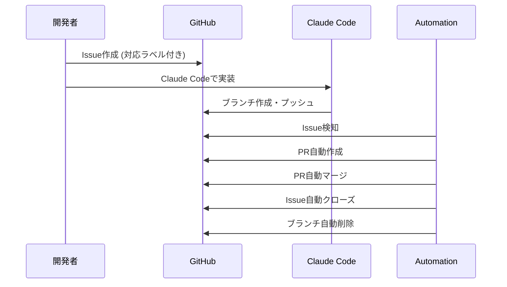

# 使用方法

**Claude Automation System** の3つの自動化ティア（Ultimate、Rapid、Smart）の使用方法を説明します。

## 🚀 自動化ティア概要

| ティア | スケジュール | 応答時間 | 最適用途 |
|--------|--------------|----------|----------|
| **🔥 Ultimate** | 毎分実行 | < 1分 | 重要プロジェクト |
| **⚡ Rapid** | 5分間隔 | < 5分 | 高速開発 |
| **🧠 Smart** | スケジュール実行 | 数時間 | 標準プロジェクト |

## 📋 基本的なワークフロー



## 🚀 Issue作成

### 基本的なIssue作成

```bash
gh issue create \
  --title "機能追加: 新機能の実装" \
  --body "新機能の詳細説明

@claude 実装をお願いします。" \
  --label "claude-processed,priority:high"
```

### 対応ラベル

| ラベル | 説明 | ティア対応 |
|--------|------|-----------|
| `claude-processed` | Claude Code標準処理 | 全ティア |
| `claude-ready` | 自動化準備完了 | 全ティア |
| `automation-ready` | 一般自動化準備完了 | 全ティア |
| `rapid-process` | Rapid処理専用 | Rapid |
| `priority:high` | 高優先度 | 全ティア |
| `priority:medium` | 中優先度 | 全ティア |
| `priority:low` | 低優先度 | 全ティア |

### Issue テンプレート例

```markdown
## 概要
実装したい機能の概要

## 要件
- [ ] 要件1
- [ ] 要件2
- [ ] 要件3

## 技術仕様
使用する技術やアプローチ

## 受け入れ条件
- [ ] 機能が正常に動作する
- [ ] テストが通る
- [ ] ドキュメントが更新されている

@claude 上記要件での実装をお願いします。
```

## 🤖 Claude Codeでの実装

### 1. 実装ブランチの作成

Claude Codeは自動的に以下の命名規則でブランチを作成します：

- `claude/issue-{番号}-{日時}`
- `feature/issue-{番号}`
- `fix/issue-{番号}`

### 2. 実装とコミット

Claude Codeが以下を自動実行：

1. 機能実装
2. テスト作成（必要に応じて）
3. ドキュメント更新
4. コミット作成
5. ブランチプッシュ

### 3. 実装例

```bash
# Claude Codeが実行する例
git checkout -b claude/issue-123-20250713_143022
# 実装作業
git add .
git commit -m "feat: 新機能実装 - Issue #123"
git push -u origin claude/issue-123-20250713_143022
```

## 🔄 自動化プロセス

### スケジュール実行

#### 平日（月-金）
- **23:00 JST**: 業務終了後の処理
- **02:00 JST**: 深夜バッチ処理
- **05:00 JST**: 早朝準備処理

#### 土日
- **10:00 JST**: 朝の開発時間
- **14:00 JST**: 午後の開発時間
- **18:00 JST**: 夕方の開発時間
- **22:00 JST**: 夜の開発時間

### 手動実行

```bash
# Ultimate Automation（最速）
gh workflow run claude-ultimate-automation.yml

# Rapid Automation（バランス型）
gh workflow run claude-rapid-automation.yml

# Smart Automation（スケジュール型）
gh workflow run claude-smart-automation.yml

# 実行状況の確認
gh run list --workflow="claude-ultimate-automation.yml" --limit 5
gh run list --workflow="claude-rapid-automation.yml" --limit 5
gh run list --workflow="claude-smart-automation.yml" --limit 5
```

### 処理フロー詳細

1. **Issue検索**
   - `claude-processed`ラベル付きのオープンIssueを検索
   - 最大50件まで同時処理

2. **ブランチ検索**
   - Issue番号を含むClaude実装ブランチを検索
   - 複数ブランチがある場合は最初のものを選択

3. **PR処理**
   - 既存PRがあれば状態確認
   - なければ新規PR作成
   - 自動的にマージ実行

4. **完了処理**
   - Issue自動クローズ
   - 完了ラベル追加
   - ブランチ自動削除

## 📊 監視と確認

### 実行状況の確認

```bash
# 最新の実行一覧
gh run list --workflow="claude-smart-automation.yml" --limit 10

# 特定実行の詳細ログ
gh run view <run-id> --log
```

### Issue状況の確認

```bash
# Claude関連Issueの確認
gh issue list --label "claude-processed" --state all

# 完了済みIssueの確認
gh issue list --label "claude-completed" --state closed
```

### PR状況の確認

```bash
# 自動化関連PRの確認
gh pr list --state all --search "Smart Automation"
```

## 🎯 ベストプラクティス

### Issue作成時

1. **明確なタイトル**: 実装内容が分かりやすいタイトルを付ける
2. **詳細な説明**: Claude Codeが理解しやすい詳細を記述
3. **適切なラベル**: `claude-processed`ラベルを必ず付ける
4. **優先度設定**: 適切な優先度ラベルを設定

### Claude Code実装時

1. **ブランチ命名**: 自動検出可能な命名規則に従う
2. **コミットメッセージ**: 分かりやすいコミットメッセージを作成
3. **テスト追加**: 可能な限りテストを含める
4. **ドキュメント更新**: 必要に応じてドキュメントを更新

### 監視・メンテナンス

1. **定期確認**: 週次での実行ログ確認
2. **エラー対応**: 失敗時の迅速な対応
3. **統計確認**: 成功率や実行時間の監視
4. **設定最適化**: 必要に応じてスケジュール調整

## ⚠️ 注意事項

### 制限事項

- **同時処理**: 最大50Issue/回
- **ブランチ検索**: Issue番号を含むブランチ名が必要
- **権限要件**: write権限が必要
- **実行頻度**: スケジュール制限あり

### トラブル時の対応

1. **手動PR作成**: 自動化が失敗した場合の手動対応
2. **ラベル確認**: 必要なラベルの存在確認
3. **権限確認**: GitHub Actions権限の再確認
4. **ログ分析**: エラーログの詳細分析

## 📈 効果測定

### 測定可能な指標

- **自動化率**: 全Issue中の自動処理率
- **処理時間**: Issue作成から完了までの時間
- **成功率**: 自動化処理の成功率
- **工数削減**: 手動作業からの工数削減効果

### 測定方法

```bash
# 成功率計算例
TOTAL_RUNS=$(gh run list --workflow="claude-smart-automation.yml" --limit 100 --json conclusion --jq '. | length')
SUCCESS_RUNS=$(gh run list --workflow="claude-smart-automation.yml" --limit 100 --json conclusion --jq '[.[] | select(.conclusion == "success")] | length')
echo "成功率: $((SUCCESS_RUNS * 100 / TOTAL_RUNS))%"
```

## 🔗 関連ドキュメント

- [セットアップガイド](setup.md) - 初期設定方法
- [カスタマイズ](customization.md) - 設定のカスタマイズ
- [トラブルシューティング](troubleshooting.md) - 問題解決方法
- [FAQ](faq.md) - よくある質問