# Claude Automation Workflow Selection Guide

## 🚀 Choose Your Automation Tier

Claude Automation now offers **three distinct automation tiers** to match different project needs and development styles. Each tier provides unique benefits optimized for specific use cases.

---

## 📊 Comparison Matrix

| Feature | Ultimate | Rapid | Smart |
|---------|----------|-------|-------|
| **Execution Frequency** | Every minute | Every 5 minutes | Scheduled (hourly) |
| **Response Time** | < 1 minute | < 5 minutes | Hours |
| **GitHub Actions Usage** | High | Medium | Low |
| **Best For** | Critical projects | Fast development | Standard projects |
| **Resource Efficiency** | Low | Medium | High |
| **Detection Speed** | Instant | Fast | Scheduled |
| **Processing Speed** | Lightning | Rapid | Smart |

---

## 🔥 Ultimate Automation

### When to Use
- **Mission-critical projects** requiring instant issue resolution
- **High-frequency development** with continuous deployments
- **Zero-latency requirements** for immediate feedback
- **Maximum productivity** scenarios

### Features
- ⚡ **Every minute execution** - Maximum responsiveness
- 🔥 **Lightning-fast processing** - Sub-minute resolution
- 🚀 **Advanced branch detection** - 6+ naming patterns
- 📊 **Performance metrics** - Real-time monitoring
- ⚡ **Zero-delay automation** - Instant processing

### Setup
```bash
./scripts/setup-ultimate-automation.sh <owner> <repo>
```

### ⚠️ Considerations
- **High GitHub Actions usage** - Monitor your consumption
- **Resource intensive** - Best for critical projects only
- **Premium tier** - Requires careful usage monitoring

---

## ⚡ Rapid Automation

### When to Use
- **Fast-paced development** requiring quick feedback
- **Balanced performance** between speed and efficiency
- **Regular development** with moderate urgency
- **Optimal resource usage** with good responsiveness

### Features
- ⚡ **5-minute intervals** - Fast and efficient
- 🚀 **Quick response time** - Rapid issue resolution
- 🎯 **Optimized processing** - Balanced performance
- 💡 **Smart resource usage** - Efficient consumption
- ⚡ **Enhanced detection** - Multiple label support

### Setup
```bash
./scripts/setup-rapid-automation.sh <owner> <repo>
```

### ✅ Recommendations
- **Ideal for most projects** - Great balance of speed and efficiency
- **Production-ready** - Proven performance
- **Cost-effective** - Optimized resource consumption

---

## 🧠 Smart Automation

### When to Use
- **Standard development projects** with regular workflows
- **Resource-conscious environments** requiring efficiency
- **Scheduled development** with predictable patterns
- **Long-term stability** over immediate response

### Features
- 🧠 **Intelligent scheduling** - Weekday nights, weekend days
- 📅 **Time-zone optimized** - JST-based scheduling
- 🎯 **Resource efficient** - Minimal Actions usage
- 🔄 **Stable and reliable** - Battle-tested workflow
- 📊 **Comprehensive logging** - Detailed process tracking

### Setup
```bash
./scripts/setup-smart-automation.sh <owner> <repo>
```

### 💡 Benefits
- **Most resource-efficient** - Minimal GitHub Actions usage
- **Stable and reliable** - Production-proven
- **Timezone-aware** - Optimized for global teams

---

## 🎯 Decision Tree

### Start Here: What's Your Priority?

```mermaid
graph TD
    A[What's your main priority?] --> B[Maximum Speed]
    A --> C[Balanced Performance]
    A --> D[Resource Efficiency]
    
    B --> E[🔥 Ultimate Automation]
    C --> F[⚡ Rapid Automation]
    D --> G[🧠 Smart Automation]
    
    E --> H[Every minute execution<br/>< 1 min response]
    F --> I[5-minute intervals<br/>< 5 min response]
    G --> J[Scheduled execution<br/>Hours response]
```



### Quick Selection Guide

1. **🔥 Choose Ultimate if:**
   - You need instant issue resolution
   - GitHub Actions usage isn't a concern
   - Working on critical/time-sensitive projects
   - Maximum productivity is essential

2. **⚡ Choose Rapid if:**
   - You want fast response with good efficiency
   - Looking for the best balance
   - Working on active development projects
   - Need quick feedback cycles

3. **🧠 Choose Smart if:**
   - Resource efficiency is important
   - Working on standard development projects
   - Prefer scheduled, predictable automation
   - GitHub Actions usage needs to be minimal

---

## 🛠️ Implementation Guide

### Step 1: Choose Your Tier
Use the decision tree and comparison matrix above to select your preferred automation tier.

### Step 2: Run Setup Script
Execute the appropriate setup script for your chosen tier:

```bash
# Ultimate (every minute)
./scripts/setup-ultimate-automation.sh <owner> <repo>

# Rapid (every 5 minutes)
./scripts/setup-rapid-automation.sh <owner> <repo>

# Smart (scheduled)
./scripts/setup-smart-automation.sh <owner> <repo>
```

### Step 3: Configure Labels
Each tier supports multiple label patterns:
- `claude-processed` - Standard processing
- `claude-ready` - Ready for automation
- `automation-ready` - General automation
- `rapid-process` - Rapid tier specific

### Step 4: Test Your Setup
Create a test issue with appropriate labels and verify automation works as expected.

---

## 📈 Monitoring & Optimization

### GitHub Actions Usage
Monitor your GitHub Actions usage in repository settings:
- **Ultimate**: High usage (every minute)
- **Rapid**: Medium usage (every 5 minutes)
- **Smart**: Low usage (scheduled)

### Performance Metrics
Each tier provides different performance characteristics:
- **Response Time**: Ultimate < Rapid < Smart
- **Resource Usage**: Ultimate > Rapid > Smart
- **Reliability**: All tiers are equally reliable

### Switching Tiers
You can easily switch between tiers by:
1. Running a different setup script
2. Updating the workflow file
3. Adjusting labels as needed

---

## 🚀 Advanced Configuration

### Custom Schedules
You can customize the execution schedule in the workflow files:

```yaml
# Ultimate - Every minute
- cron: '* * * * *'

# Rapid - Every 5 minutes
- cron: '*/5 * * * *'

# Smart - Weekday nights, weekend days
- cron: '0 14,17,20 * * 1-5'  # Weekdays
- cron: '0 1,5,9,13 * * 0,6'   # Weekends
```

### Branch Patterns
All tiers support advanced branch detection:
- `issue-{number}`
- `claude-{number}`
- `feature/issue-{number}`
- `fix/issue-{number}`
- `claude/issue-{number}`
- `automation-{number}`

### Multiple Workflows
You can run multiple automation tiers simultaneously for different types of issues by using different labels.

---

## 🎉 Conclusion

Choose the automation tier that best fits your project needs:

- **🔥 Ultimate** for maximum speed and instant response
- **⚡ Rapid** for balanced performance and efficiency
- **🧠 Smart** for resource-conscious, scheduled automation

Each tier is production-ready and offers unique advantages. Start with **Rapid** if you're unsure - it provides the best balance for most use cases.