<<<<<<< HEAD
# Claude Automation Workflow Guide

## 🚀 Overview

This guide explains the two main workflows that power the Claude Automation system:

1.  **`claude-smart-automation.yml`**: Handles the end-to-end automation of turning issues into merged pull requests.
2.  **`claude-code-review.yml`**: Ensures the quality and security of pull requests before they are merged.

---

## 🧠 `claude-smart-automation.yml`

### Purpose
This workflow is the core of the automation system. It periodically scans for issues that are ready for automation and processes them from pull request creation to branch cleanup.

### Triggers
-   **Scheduled Execution**: Runs automatically on a schedule optimized for development cycles (weekday nights and weekend days).
-   **Manual Trigger (`workflow_dispatch`)**: Can be run manually from the GitHub Actions tab to process specific issues immediately.

### Key Features
-   **Issue Detection**: Finds open issues with labels like `claude-processed`, `claude-ready`, or `automation-ready`.
-   **Branch Matching**: Automatically finds the corresponding feature branch for an issue (e.g., `feature/issue-123`).
-   **Pull Request Creation**: If a PR doesn't exist, it creates one automatically.
-   **Auto-Merging**: Merges the pull request using the squash and merge strategy.
-   **Cleanup**: Closes the issue and deletes the feature branch after a successful merge.

---

## 🎯 `claude-code-review.yml`

### Purpose
This workflow acts as a gatekeeper for all new pull requests, ensuring they meet quality and security standards before they can be merged.

### Triggers
-   **Pull Request Creation/Update**: Runs automatically whenever a pull request is opened, updated, or marked as ready for review.

### Key Features
-   **Quality Gate**: Performs automated checks on new pull requests:
    -   **PR Size**: Ensures that pull requests are not too large.
    -   **Static Analysis**: Scans for hardcoded secrets, `console.log` statements, and other common issues.
-   **AI-Powered Code Review**: After passing the quality gate, it runs an AI-powered code review to provide feedback and suggestions.
-   **Status Checks**: Sets the commit status on the pull request to indicate whether the checks have passed or failed, blocking merges if necessary.

---

## 🔄 How They Work Together

1.  A developer creates a pull request.
2.  The **`claude-code-review.yml`** workflow is triggered automatically.
    -   It runs the quality gate and AI review.
    -   If the checks fail, the PR is marked as blocked.
    -   If the checks pass, the PR is marked as ready for merge.
3.  The **`claude-smart-automation.yml`** workflow runs on its schedule.
    -   It finds the approved pull request associated with a labeled issue.
    -   It merges the pull request.
    -   It closes the issue and deletes the branch.


=======
# Claude Automation Workflow Selection Guide 🤖

[](../REPAIRGPT_INTEGRATION.md)
[](../test_repairgpt_enhancements.js)

## 🚀 Choose Your RepairGPT-Enhanced Automation Tier

Claude Automation now offers **six sophisticated automation tiers** inspired by RepairGPT's advanced patterns. Each tier provides unique benefits optimized for specific enterprise needs and development workflows.

---

## 📊 RepairGPT-Enhanced Comparison Matrix

| Feature | Ultimate | Full | Rapid | Smart | Code Review | Issue Processor |
|---------|----------|------|-------|-------|-------------|----------------|
| **Execution** | Every minute | RepairGPT Schedule | Every 5 min | Intelligent | PR-triggered | Daily + Events |
| **Response Time** | < 1 minute | < 3 minutes | < 5 minutes | Hours | Instant | 24 hours |
| **Security Patterns** | 17 | 17 | 17 | 17 | 17 | N/A |
| **Quality Checks** | 9 | 9 | 9 | 9 | 9 | N/A |
| **Multi-Stage** | ✅ | ✅ | ✅ | ✅ | ✅ | ✅ |
| **Best For** | Critical | Enterprise | Fast dev | Standard | Quality focus | Management |
| **Resource Usage** | High | Medium | Medium | Low | Low | Very Low |
| **RepairGPT Features** | All | All | Most | Some | Review only | Processing only |

---

## 🔥 Ultimate Automation (RepairGPT Max Performance)

### When to Use
- **Mission-critical projects** requiring instant issue resolution
- **High-frequency development** with continuous deployments  
- **Zero-latency requirements** for immediate feedback
- **Enterprise-grade performance** scenarios
- **RepairGPT-level sophistication** needed

### RepairGPT-Enhanced Features
- ⚡ **Every minute execution** - Maximum responsiveness
- 🛡️ **17 Security patterns** - Comprehensive malicious code detection
- 🔍 **9 Quality checks** - Advanced validation system
- 🔗 **workflow_run triggers** - Multi-stage orchestration
- 🏷️ **Enhanced labeling** - 13+ automation labels
- 🚀 **Advanced branch detection** - 9+ naming patterns
- 📊 **Performance metrics** - Real-time monitoring
- ⚡ **Zero-delay automation** - Sub-minute processing

### Setup
```bash
./scripts/setup-ultimate-automation.sh <owner> <repo>
```

### ⚠️ Considerations
- **High GitHub Actions usage** - Monitor your consumption carefully
- **Resource intensive** - Best for critical projects only
- **Enterprise tier** - Requires premium GitHub Actions allocation

---

## 🚀 Full Automation (RepairGPT Enterprise Grade)

### When to Use
- **Enterprise projects** requiring comprehensive automation
- **Production environments** with complex workflows
- **RepairGPT scheduling patterns** for optimal performance
- **Complete feature set** requirements

### RepairGPT-Enhanced Features
- 🕐 **RepairGPT scheduling** - Intelligent weekday/weekend patterns
- 🛡️ **Full security suite** - All 17 security patterns
- 🔍 **Complete quality system** - 9-point validation
- 🔗 **Multi-stage orchestration** - Issue processor integration
- 🏷️ **Advanced labeling** - Priority-based processing
- 📊 **Enterprise metrics** - Comprehensive analytics
- 🌐 **Global optimization** - Timezone-aware execution

### Setup
```bash
./scripts/setup-full-automation.sh <owner> <repo>
```

### ✅ Enterprise Benefits
- **Complete RepairGPT feature set** - All enhancements included
- **Production-tested** - Battle-proven reliability
- **Scalable architecture** - Handles large teams and projects

---

## ⚡ Rapid Automation (RepairGPT Speed Optimized)

### When to Use
- **Fast-paced development** requiring quick feedback
- **Balanced performance** between speed and efficiency
- **Regular development** with moderate urgency
- **RepairGPT patterns** with optimized resource usage

### RepairGPT-Enhanced Features
- ⚡ **5-minute intervals** - Fast and efficient
- 🛡️ **Full security suite** - 17 security patterns
- 🔍 **Complete quality checks** - 9 validation points
- 🔗 **Multi-stage workflows** - Issue processor integration
- 🏷️ **Advanced labeling** - Priority-based processing
- 🚀 **Quick response time** - Rapid issue resolution
- 🎯 **Optimized processing** - Balanced performance
- 💡 **Smart resource usage** - Efficient consumption

### Setup
```bash
./scripts/setup-rapid-automation.sh <owner> <repo>
```

### ✅ Recommendations
- **Ideal for most projects** - Great balance of speed and efficiency
- **Production-ready** - Proven performance with RepairGPT features
- **Cost-effective** - Optimized resource consumption

---

## 🧠 Smart Automation (RepairGPT Intelligent Scheduling)

### When to Use
- **Standard development projects** with regular workflows
- **Resource-conscious environments** requiring efficiency
- **Global teams** needing timezone optimization
- **RepairGPT scheduling patterns** for optimal performance

### RepairGPT-Enhanced Features
- 🧠 **RepairGPT scheduling** - Weekday nights (23:00, 02:00, 05:00 JST), weekend days (10:00, 14:00, 18:00, 22:00 JST)
- 🛡️ **Security integration** - All 17 patterns included
- 🔍 **Quality assurance** - 9-point validation system
- 📅 **Timezone intelligence** - JST-optimized for global teams
- 🔗 **Multi-trigger support** - Schedule + workflow_run + manual
- 🎯 **Resource efficient** - Minimal Actions usage
- 🔄 **Enterprise reliability** - Production-tested workflow
- 📊 **Comprehensive analytics** - Detailed process tracking

### Setup
```bash
./scripts/setup-smart-automation.sh <owner> <repo>
```

### 💡 Benefits
- **Most resource-efficient** - Minimal GitHub Actions usage
- **RepairGPT intelligence** - Advanced scheduling patterns
- **Global team ready** - Timezone-optimized execution

---

## 🤖 Code Review Automation (RepairGPT Quality Focus)

### When to Use
- **Quality-focused development** requiring thorough review
- **Security-sensitive projects** needing comprehensive scanning
- **Pull request automation** for consistent reviews
- **RepairGPT validation standards** enforcement

### RepairGPT-Enhanced Features
- 🔍 **AI code review** - Automated security and quality assessment
- 🛡️ **17 Security patterns** - Comprehensive malicious code detection
- 📊 **Risk scoring** - Multi-factor risk evaluation
- 🏷️ **Smart labeling** - Automated issue categorization
- ⚡ **Instant feedback** - PR-triggered immediate review
- 📈 **Quality metrics** - Detailed analysis reporting

### Setup
```bash
# Included in all automation tiers
# Runs automatically on PR creation/updates
```

---

## 🔄 Issue Processor (RepairGPT Management)

### When to Use
- **Project management** automation
- **Issue categorization** and prioritization
- **Team coordination** with auto-assignment
- **Repository maintenance** with staleness detection

### RepairGPT-Enhanced Features
- 🤖 **AI categorization** - Automatic issue type detection
- 🎯 **Priority assignment** - Smart urgency evaluation
- 👥 **Auto-assignment** - Intelligent reviewer allocation
- 🕐 **Staleness detection** - Old issue management
- 🏷️ **Label management** - Comprehensive categorization
- 📅 **Scheduled processing** - Daily + event-driven

### Setup
```bash
# Included in Full and Ultimate tiers
# Available as standalone: claude-issue-processor.yml
```

---

## 🎯 Decision Tree

### Start Here: What's Your Priority?

```mermaid
graph TD
    A[What's your main priority?] --> B[Maximum Speed & Features]
    A --> C[Enterprise Grade]
    A --> D[Balanced Performance]
    A --> E[Resource Efficiency]
    A --> F[Quality Focus]
    A --> G[Management Only]
    
    B --> H[🔥 Ultimate Automation]
    C --> I[🚀 Full Automation]
    D --> J[⚡ Rapid Automation]
    E --> K[🧠 Smart Automation]
    F --> L[🤖 Code Review]
    G --> M[🔄 Issue Processor]
    
    H --> N[Every minute<br/>All RepairGPT features]
    I --> O[RepairGPT schedule<br/>Enterprise grade]
    J --> P[5-minute intervals<br/>Speed optimized]
    K --> Q[Intelligent schedule<br/>Resource efficient]
    L --> R[PR-triggered<br/>Quality focused]
    M --> S[Daily processing<br/>Management only]
```



### Quick Selection Guide

1. **🔥 Choose Ultimate if:**
   - You need maximum speed and all RepairGPT features
   - GitHub Actions usage isn't a concern
   - Working on mission-critical projects
   - Enterprise-grade performance is essential

2. **🚀 Choose Full if:**
   - You want complete RepairGPT feature set
   - Need enterprise-grade reliability
   - Working on production systems
   - Optimal scheduling patterns desired

3. **⚡ Choose Rapid if:**
   - You want fast response with RepairGPT features
   - Looking for the best speed/efficiency balance
   - Working on active development projects
   - Need quick feedback cycles

4. **🧠 Choose Smart if:**
   - Resource efficiency is important
   - Working on standard development projects
   - Need RepairGPT intelligence with minimal usage
   - Global team timezone optimization required

5. **🤖 Choose Code Review if:**
   - Primary focus is on code quality
   - Security scanning is paramount
   - PR-based workflow preferred
   - Quality metrics are essential

6. **🔄 Choose Issue Processor if:**
   - Focus on project management automation
   - Need issue categorization and assignment
   - Repository maintenance is priority
   - Minimal automation overhead desired

>>>>>>> 2f2d9e4 (enhance: Implement RepairGPT-inspired automation system with comprehensive improvements)
---

## 🔧 Customization

<<<<<<< HEAD
### Changing the Automation Schedule
To change how often the `claude-smart-automation.yml` workflow runs, you can edit the `cron` schedule in the workflow file:

```yaml
# .github/workflows/claude-smart-automation.yml
schedule:
  # Example: Run every 6 hours
  - cron: '0 */6 * * *'
```

### Adjusting Quality Gates
The quality gate thresholds in `claude-code-review.yml` can be adjusted to fit your project's needs. For example, to change the maximum number of lines allowed in a PR:

```javascript
// .github/workflows/claude-code-review.yml
// ...
if (pr.data.additions + pr.data.deletions > 1000) { // Changed from 500 to 1000
  issues.push('❌ PR is too large (> 1000 lines changed).');
}
// ...
```
=======
### Step 1: Choose Your Tier
Use the decision tree and comparison matrix above to select your preferred automation tier.

### Step 2: Run Setup Script
Execute the appropriate setup script for your chosen tier:

```bash
# Ultimate (every minute, all features)
./scripts/setup-ultimate-automation.sh <owner> <repo>

# Full (RepairGPT schedule, enterprise)
./scripts/setup-full-automation.sh <owner> <repo>

# Rapid (every 5 minutes, speed optimized)
./scripts/setup-rapid-automation.sh <owner> <repo>

# Smart (intelligent schedule, efficient)
./scripts/setup-smart-automation.sh <owner> <repo>
```

### Step 3: Configure RepairGPT-Enhanced Labels
Each tier supports advanced RepairGPT-inspired label patterns:

#### **Automation Triggers**
- `claude-processed` - Standard processing
- `claude-ready` - Ready for automation  
- `automation-ready` - General automation
- `rapid-process` - Rapid tier specific
- `claude-issue-processor` - Issue processor handled
- `claude-full-automation` - Full automation pipeline

#### **Priority System (RepairGPT)**
- `priority:critical` - Immediate processing (auto-assigned)
- `priority:high` - High priority processing
- `urgent` - Urgent issue handling
- `hotfix` - Emergency fix processing

#### **Quality & Security**
- `security-review` - Security-focused validation
- `quality:gold` - Highest quality requirements
- `complexity:high` - Complex issue marking

### Step 4: Test Your Setup
Create a test issue with appropriate labels and verify automation works as expected.

---

## 📈 Monitoring & Optimization

### GitHub Actions Usage
Monitor your GitHub Actions usage in repository settings:
- **Ultimate**: High usage (every minute + full features)
- **Full**: Medium-high usage (RepairGPT schedule + enterprise features)
- **Rapid**: Medium usage (every 5 minutes + most features)
- **Smart**: Low usage (intelligent schedule + core features)
- **Code Review**: Very low usage (PR-triggered only)
- **Issue Processor**: Minimal usage (daily + events)

### RepairGPT Performance Metrics
Each tier provides different performance characteristics:
- **Response Time**: Ultimate < Full < Rapid < Smart
- **Feature Completeness**: Ultimate = Full > Rapid > Smart > Code Review > Issue Processor
- **Resource Usage**: Ultimate > Full > Rapid > Smart > Code Review > Issue Processor
- **RepairGPT Integration**: All tiers include core RepairGPT enhancements

### Switching Tiers
You can easily switch between tiers by:
1. Running a different setup script
2. Updating the workflow file
3. Adjusting labels as needed
4. All RepairGPT enhancements are preserved

---

## 🚀 Advanced Configuration

### Custom Schedules
You can customize the execution schedule in the workflow files:

```yaml
# Ultimate - Every minute (maximum performance)
- cron: '* * * * *'

# Full - RepairGPT intelligent patterns
- cron: '0 14,17,20 * * 1-5'  # Weekday nights JST
- cron: '0 1,5,9,13 * * 0,6'   # Weekend days JST

# Rapid - Every 5 minutes (speed optimized)
- cron: '*/5 * * * *'

# Smart - Intelligent schedule (resource efficient)
- cron: '0 14,17,20 * * 1-5'  # Weekdays
- cron: '0 1,5,9,13 * * 0,6'   # Weekends
```

### RepairGPT-Enhanced Branch Patterns
All tiers support sophisticated branch detection (9+ patterns):
- `issue-{number}` - Standard issue branches
- `claude-{number}` - Claude-specific branches
- `feature/issue-{number}` - Feature development
- `fix/issue-{number}` - Bug fix branches
- `hotfix/issue-{number}` - Emergency fixes
- `claude/issue-{number}` - Claude namespace
- `automation-{number}` - Automation branches
- `security/issue-{number}` - Security fixes
- `enhancement/issue-{number}` - Enhancements

### Multiple Workflows
You can run multiple automation tiers simultaneously for different types of issues by using different labels and workflow combinations.

### RepairGPT Security & Quality
All tiers include:
- **17 Security Patterns**: Comprehensive malicious code detection
- **9 Quality Checks**: Advanced validation system
- **Secret Leakage Prevention**: Automatic credential scanning
- **Naming Convention Validation**: Code standard enforcement
>>>>>>> 2f2d9e4 (enhance: Implement RepairGPT-inspired automation system with comprehensive improvements)

---

## 🎉 Conclusion

<<<<<<< HEAD
This streamlined, two-workflow system provides a powerful and maintainable way to automate your development process. It combines the proactive quality assurance of a dedicated review workflow with the efficiency of a scheduled automation workflow.
=======
Choose the RepairGPT-enhanced automation tier that best fits your project needs:

- **🔥 Ultimate** for maximum speed and complete RepairGPT feature set
- **🚀 Full** for enterprise-grade automation with RepairGPT intelligence
- **⚡ Rapid** for balanced performance with RepairGPT enhancements
- **🧠 Smart** for resource-efficient automation with RepairGPT patterns
- **🤖 Code Review** for quality-focused RepairGPT validation
- **🔄 Issue Processor** for management automation with RepairGPT intelligence

Each tier is production-ready and includes RepairGPT's sophisticated patterns. Start with **Full** for enterprise projects or **Rapid** for development teams - both provide excellent RepairGPT integration.

---

**🤖 Powered by RepairGPT-Enhanced Technology** | **Enterprise-Grade Automation**
>>>>>>> 2f2d9e4 (enhance: Implement RepairGPT-inspired automation system with comprehensive improvements)
