# Claude Automation Workflow Guide

## 🚀 Overview

This guide explains the two main workflows that power the Claude Automation system:

1.  **`claude-smart-automation.yml`**: Handles the end-to-end automation of turning issues into merged pull requests.
2.  **`claude-code-review.yml`**: Ensures the quality and security of pull requests before they are merged.

---

## 🧠 `claude-smart-automation.yml`

### Purpose
This workflow is the core of the automation system. It periodically scans for issues that are ready for automation and processes them from pull request creation to branch cleanup.

### Triggers
-   **Scheduled Execution**: Runs automatically on a schedule optimized for development cycles (weekday nights and weekend days).
-   **Manual Trigger (`workflow_dispatch`)**: Can be run manually from the GitHub Actions tab to process specific issues immediately.

### Key Features
-   **Issue Detection**: Finds open issues with labels like `claude-processed`, `claude-ready`, or `automation-ready`.
-   **Branch Matching**: Automatically finds the corresponding feature branch for an issue (e.g., `feature/issue-123`).
-   **Pull Request Creation**: If a PR doesn't exist, it creates one automatically.
-   **Auto-Merging**: Merges the pull request using the squash and merge strategy.
-   **Cleanup**: Closes the issue and deletes the feature branch after a successful merge.

---

## 🎯 `claude-code-review.yml`

### Purpose
This workflow acts as a gatekeeper for all new pull requests, ensuring they meet quality and security standards before they can be merged.

### Triggers
-   **Pull Request Creation/Update**: Runs automatically whenever a pull request is opened, updated, or marked as ready for review.

### Key Features
-   **Quality Gate**: Performs automated checks on new pull requests:
    -   **PR Size**: Ensures that pull requests are not too large.
    -   **Static Analysis**: Scans for hardcoded secrets, `console.log` statements, and other common issues.
-   **AI-Powered Code Review**: After passing the quality gate, it runs an AI-powered code review to provide feedback and suggestions.
-   **Status Checks**: Sets the commit status on the pull request to indicate whether the checks have passed or failed, blocking merges if necessary.

---

## 🔄 How They Work Together

1.  A developer creates a pull request.
2.  The **`claude-code-review.yml`** workflow is triggered automatically.
    -   It runs the quality gate and AI review.
    -   If the checks fail, the PR is marked as blocked.
    -   If the checks pass, the PR is marked as ready for merge.
3.  The **`claude-smart-automation.yml`** workflow runs on its schedule.
    -   It finds the approved pull request associated with a labeled issue.
    -   It merges the pull request.
    -   It closes the issue and deletes the branch.

```mermaid
graph TD
    A[📝 Pull Request Created] --> B{🤖 `claude-code-review.yml` Triggered};
    B --> C{🔍 Quality Gate & AI Review};
    C -->|❌ Failed| D[PR Blocked];
    C -->|✅ Passed| E[PR Approved];
    E --> F{🤖 `claude-smart-automation.yml` Triggered};
    F --> G[🚀 Auto-Merge PR];
    G --> H[🎉 Close Issue & Clean Up];
```



---

## 🔧 Customization

### Changing the Automation Schedule
To change how often the `claude-smart-automation.yml` workflow runs, you can edit the `cron` schedule in the workflow file:

```yaml
# .github/workflows/claude-smart-automation.yml
schedule:
  # Example: Run every 6 hours
  - cron: '0 */6 * * *'
```

### Adjusting Quality Gates
The quality gate thresholds in `claude-code-review.yml` can be adjusted to fit your project's needs. For example, to change the maximum number of lines allowed in a PR:

```javascript
// .github/workflows/claude-code-review.yml
// ...
if (pr.data.additions + pr.data.deletions > 1000) { // Changed from 500 to 1000
  issues.push('❌ PR is too large (> 1000 lines changed).');
}
// ...
```

---

## 🎉 Conclusion

This streamlined, two-workflow system provides a powerful and maintainable way to automate your development process. It combines the proactive quality assurance of a dedicated review workflow with the efficiency of a scheduled automation workflow.
