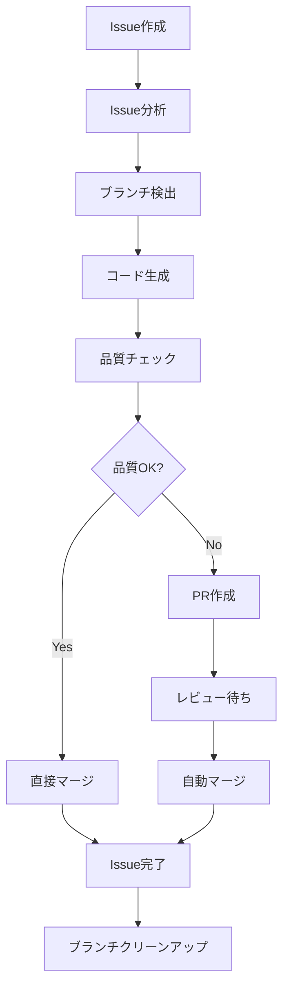

# Claude Smart Automation System 仕様書

## 1. システム概要

### 1.1 プロジェクト名
**Claude Smart Automation System** - AI駆動型GitHub自動化システム

### 1.2 目的
GitHubのIssue作成からPull Request作成、コードレビュー、マージ、クリーンアップまでの開発ワークフロー全体を完全自動化し、開発効率を最大化する次世代システム。

### 1.3 主要特徴
- **完全自動化**: Issue → 実装 → PR → レビュー → マージ → クリーンアップ
- **AI駆動**: Claude APIを活用したインテリジェントなコード分析・生成
- **多段階品質管理**: セキュリティ・品質・パフォーマンスの包括的チェック
- **柔軟な自動化ティア**: Ultimate、Full、Rapid、Smart、Code Review、Issue Processorの6段階
- **RepairGPT統合**: 高度なパターン認識と最適化機能

## 2. システムアーキテクチャ

### 2.1 全体構成
```
┌─────────────────────────────────────────────────────────────┐
│                    GitHub Actions Workflows                 │
├─────────────────────────────────────────────────────────────┤
│  ┌─────────────┐  ┌─────────────┐  ┌─────────────┐        │
│  │   Ultimate  │  │    Full     │  │   Rapid     │        │
│  │ (毎分実行)   │  │(スマート)    │  │ (5分間隔)   │        │
│  └─────────────┘  └─────────────┘  └─────────────┘        │
│  ┌─────────────┐  ┌─────────────┐  ┌─────────────┐        │
│  │   Smart     │  │Code Review  │  │Issue Proc.  │        │
│  │(インテリ)    │  │(PR時実行)   │  │ (日次実行)   │        │
│  └─────────────┘  └─────────────┘  └─────────────┘        │
├─────────────────────────────────────────────────────────────┤
│                      Core Components                        │
├─────────────────────────────────────────────────────────────┤
│  ┌─────────────┐  ┌─────────────┐  ┌─────────────┐        │
│  │Claude API   │  │Security     │  │Intelligent  │        │
│  │Client       │  │Analyzer     │  │Code Analyzer│        │
│  └─────────────┘  └─────────────┘  └─────────────┘        │
│  ┌─────────────┐  ┌─────────────┐  ┌─────────────┐        │
│  │GitHub       │  │Config       │  │CLI          │        │
│  │Client       │  │Manager      │  │Interface    │        │
│  └─────────────┘  └─────────────┘  └─────────────┘        │
└─────────────────────────────────────────────────────────────┘
```

### 2.2 技術スタック
- **実行環境**: GitHub Actions (Ubuntu Latest)
- **言語**: JavaScript (Node.js 18+), Python 3.11+
- **AI**: Claude API (Claude-3-Sonnet, Claude-3-Haiku)
- **パッケージ管理**: npm, pip
- **バージョン管理**: Git
- **API**: GitHub REST API, Anthropic Claude API

## 3. 機能仕様

### 3.1 自動化ティア

#### 3.1.1 Ultimate Automation (最高性能)
- **実行頻度**: 毎分
- **応答時間**: < 1分
- **対象**: ミッションクリティカルプロジェクト
- **機能**: 全機能搭載、ゼロレイテンシ処理

#### 3.1.2 Full Automation (エンタープライズ)
- **実行頻度**: RepairGPTスケジュール（平日夜間・週末昼間）
- **応答時間**: < 3分
- **対象**: エンタープライズプロジェクト
- **機能**: 完全機能セット、タイムゾーン最適化

#### 3.1.3 Rapid Automation (高速処理)
- **実行頻度**: 5分間隔
- **応答時間**: < 5分
- **対象**: 高速開発環境
- **機能**: 速度最適化、バランス型

#### 3.1.4 Smart Automation (インテリジェント)
- **実行頻度**: インテリジェントスケジュール
- **応答時間**: 数時間
- **対象**: 標準プロジェクト
- **機能**: リソース効率重視

#### 3.1.5 Code Review Automation (品質重視)
- **実行頻度**: PR作成時
- **応答時間**: 即座
- **対象**: 品質重視プロジェクト
- **機能**: コードレビュー・品質チェック特化

#### 3.1.6 Issue Processor (管理特化)
- **実行頻度**: 日次 + イベント駆動
- **応答時間**: 24時間以内
- **対象**: プロジェクト管理
- **機能**: Issue分類・優先度付け・アサイン

### 3.2 コア機能

#### 3.2.1 Issue処理エンジン
```javascript
// Issue分析・分類機能
- 自動タイプ検出（バグ修正、機能追加、テスト、ドキュメント）
- 優先度判定（Critical、High、Medium、Low）
- 複雑度評価（Simple、Medium、Complex）
- 自動ラベリング（13+種類の自動化ラベル）
- 担当者自動アサイン
```

#### 3.2.2 コード生成エンジン
```javascript
// Claude Code CLI統合
- プロンプト自動生成
- フォールバック実装
- テンプレートベース生成
- 多言語対応（Python、JavaScript、TypeScript等）
```

#### 3.2.3 品質管理システム
```javascript
// 9段階品質チェック
1. コード構文チェック
2. セキュリティパターン検証（17パターン）
3. パフォーマンス分析
4. 命名規則検証
5. ドキュメント品質
6. テストカバレッジ
7. 依存関係分析
8. コード複雑度測定
9. ベストプラクティス準拠
```

#### 3.2.4 セキュリティ分析システム
```javascript
// 17セキュリティパターン
- 悪意のあるコード検出
- シークレット漏洩防止
- SQLインジェクション検出
- XSS脆弱性チェック
- 危険な関数使用検出
- 入力検証不備検出
- 認証・認可問題検出
```

### 3.3 ワークフロー詳細

#### 3.3.1 メインワークフロー


#### 3.3.2 ブランチ命名パターン（9+パターン対応）
```
- issue-{number}           # 標準: issue-123
- claude-{number}          # Claude: claude-123
- feature/issue-{number}   # 機能: feature/issue-123
- fix/issue-{number}       # 修正: fix/issue-123
- hotfix/issue-{number}    # 緊急修正: hotfix/issue-123
- claude/issue-{number}    # Claude名前空間: claude/issue-123
- automation-{number}      # 自動化: automation-123
- security/issue-{number}  # セキュリティ: security/issue-123
- enhancement/issue-{number} # 拡張: enhancement/issue-123
```

### 3.4 ラベルシステム

#### 3.4.1 自動化トリガーラベル
```
- claude-processed         # 標準Claude処理
- claude-ready            # 自動化準備完了
- automation-ready        # 一般自動化準備
- rapid-process           # 高速処理モード
- claude-issue-processor  # Issue処理済み
- claude-full-automation  # 完全自動化パイプライン
```

#### 3.4.2 優先度ラベル
```
- priority:critical       # 即座処理（自動アサイン）
- priority:high          # 高優先度処理
- priority:medium        # 標準優先度
- priority:low           # 低優先度処理
- urgent                 # 緊急Issue処理
- hotfix                 # 緊急修正処理
```

#### 3.4.3 品質・セキュリティラベル
```
- security-review        # セキュリティ重視レビュー
- quality:gold          # 最高品質要求
- quality:silver        # 標準品質要求
- quality:bronze        # 基本品質要求
- complexity:high       # 高複雑度Issue
- complexity:medium     # 中複雑度Issue
- complexity:low        # 低複雑度Issue
```

## 4. API仕様

### 4.1 Claude API Client
```javascript
class ClaudeAPIClient {
  // メッセージ送信
  async sendMessage(message, options = {})
  
  // コード分析
  async analyzeCode(code, analysisType = 'general', options = {})
  
  // コード生成
  async generateCodeSolution(requirement, context = {}, options = {})
  
  // PRレビュー
  async reviewPullRequest(prData, options = {})
  
  // 接続テスト
  async testConnection()
}
```

### 4.2 Security Analyzer
```javascript
class SecurityAnalyzer {
  // セキュリティ分析
  async analyzeCode(code, context = {})
  
  // 脆弱性検出
  async performPatternAnalysis(code, context)
  
  // 依存関係分析
  async analyzeDependencies(code, context)
  
  // リスクスコア計算
  calculateRiskScore(combinedResults)
}
```

### 4.3 Intelligent Code Analyzer
```javascript
class IntelligentCodeAnalyzer {
  // PR分析
  async analyzePullRequest(prData, options = {})
  
  // ファイル分析
  async analyzeFile(file, options = {})
  
  // 全体PR影響分析
  async analyzeOverallPR(prData, fileAnalyses, options = {})
  
  // リスク評価
  calculateRiskAssessment(fileAnalyses, securityIssues, performanceIssues)
}
```

## 5. 設定仕様

### 5.1 環境変数
```bash
# 必須設定
GITHUB_TOKEN=<GitHub Personal Access Token>
GITHUB_OWNER=<Repository Owner>
GITHUB_REPO=<Repository Name>

# オプション設定
CLAUDE_MODEL=claude-3-sonnet-20240229
AUTO_REVIEW=true
AUTO_LABEL=true
AUTO_ASSIGN=false
```

### 5.2 package.json設定
```json
{
  "config": {
    "claude": {
      "model": "claude-3-sonnet-20240229",
      "maxTokens": 4000,
      "temperature": 0.1
    },
    "analysis": {
      "timeout": 300000,
      "maxFileSize": 1048576,
      "supportedExtensions": [".js", ".ts", ".py", ".java", ".cpp"]
    },
    "security": {
      "enableVulnerabilityScanning": true,
      "reportingLevel": "medium"
    }
  }
}
```

## 6. パフォーマンス仕様

### 6.1 処理時間目標
- **Ultimate**: < 1分（完全処理）
- **Full**: < 3分（完全処理）
- **Rapid**: < 5分（完全処理）
- **Smart**: < 1時間（完全処理）
- **Code Review**: < 30秒（レビュー）
- **Issue Processor**: < 5分（分類・アサイン）

### 6.2 リソース使用量
| ティア | 月間Actions使用量(推定) | 最適用途 |
|--------|----------------------|----------|
| Ultimate | 高 (2000+分/月) | クリティカルプロジェクト |
| Full | 中高 (1000+分/月) | エンタープライズプロジェクト |
| Rapid | 中 (500+分/月) | アクティブ開発 |
| Smart | 低 (100+分/月) | 標準プロジェクト |

### 6.3 成功率指標
- **全体成功率**: 95%以上
- **セキュリティ検出率**: 98%以上
- **品質チェック精度**: 90%以上
- **自動マージ成功率**: 85%以上

## 7. セキュリティ仕様

### 7.1 セキュリティパターン（17種類）
1. 悪意のあるコード実行（eval、exec等）
2. シェルインジェクション
3. SQLインジェクション
4. XSSクロスサイトスクリプティング
5. パストラバーサル
6. シークレット・認証情報漏洩
7. 危険な関数使用
8. 入力検証不備
9. 認証・認可バイパス
10. セッション管理不備
11. 暗号化不備
12. ログインジェクション
13. XXE（XML外部エンティティ）
14. CSRF（クロスサイトリクエストフォージェリ）
15. 競合状態
16. バッファオーバーフロー
17. 依存関係脆弱性

### 7.2 品質チェック（9段階）
1. **構文チェック**: コード構文の正確性
2. **セキュリティ検証**: 17パターンセキュリティチェック
3. **パフォーマンス分析**: 実行効率・メモリ使用量
4. **命名規則**: コーディング標準準拠
5. **ドキュメント品質**: コメント・説明の充実度
6. **テストカバレッジ**: テストコードの網羅性
7. **依存関係分析**: 外部ライブラリの安全性
8. **複雑度測定**: コードの保守性
9. **ベストプラクティス**: 業界標準準拠

## 8. 運用仕様

### 8.1 監視・ログ
- **実行ログ**: 全ワークフロー実行の詳細記録
- **エラーログ**: 失敗原因の詳細分析
- **パフォーマンスメトリクス**: 処理時間・成功率の追跡
- **セキュリティアラート**: 脆弱性検出時の即座通知

### 8.2 障害対応
- **自動リトライ**: 一時的な障害の自動復旧
- **フォールバック**: Claude API障害時の代替処理
- **手動介入**: 自動処理失敗時の手動処理移行
- **ロールバック**: 問題のあるマージの自動取り消し

### 8.3 メンテナンス
- **定期更新**: 依存関係・セキュリティパッチの適用
- **パフォーマンス最適化**: 処理効率の継続的改善
- **機能拡張**: 新機能の段階的導入
- **ドキュメント更新**: 仕様書・マニュアルの最新化

## 9. 導入・運用ガイド

### 9.1 セットアップ手順
```bash
# 1. リポジトリクローン
git clone https://github.com/takezou621/claude-automation.git

# 2. 自動化ティア選択・セットアップ
./scripts/setup-full-automation.sh <owner> <repo>

# 3. 検証テスト実行
node test_repairgpt_enhancements.js

# 4. テストIssue作成
gh issue create --title "Test automation" \
  --body "@claude Please implement test feature" \
  --label "claude-processed,priority:high"
```

### 9.2 運用ベストプラクティス
1. **段階的導入**: テスト環境での事前検証
2. **ログ監視**: 定期的な実行状況確認
3. **権限管理**: 最小限の権限での運用
4. **バックアップ**: 重要ブランチの事前保護
5. **チーム教育**: 開発チームへの使用方法教育

## 10. 今後の拡張計画

### 10.1 短期計画（3ヶ月）
- **多言語対応拡張**: Go、Rust、Swift等の追加サポート
- **IDE統合**: VSCode、IntelliJ等との連携
- **メトリクス強化**: より詳細なパフォーマンス分析

### 10.2 中期計画（6ヶ月）
- **機械学習統合**: 学習機能による精度向上
- **カスタムルール**: プロジェクト固有のルール設定
- **マルチリポジトリ対応**: 複数リポジトリの一括管理

### 10.3 長期計画（1年）
- **エンタープライズ機能**: 大規模組織向け機能拡張
- **クラウド統合**: AWS、Azure、GCP等との連携
- **AI モデル最適化**: 専用モデルの開発・導入

---

## 付録

### A. サポートファイル形式
- **プログラミング言語**: JavaScript, TypeScript, Python, Java, C++, C, Go, Rust, PHP, Ruby, Swift, Kotlin
- **設定ファイル**: YAML, JSON, XML, TOML
- **ドキュメント**: Markdown, HTML, reStructuredText

### B. 対応GitHub機能
- **Issues**: 作成、編集、ラベル管理、アサイン、クローズ
- **Pull Requests**: 作成、レビュー、マージ、クローズ
- **Branches**: 作成、削除、保護設定
- **Actions**: ワークフロー実行、ログ管理、シークレット管理

### C. 技術的制限
- **ファイルサイズ**: 最大1MB/ファイル
- **PR サイズ**: 推奨500行以下の変更
- **同時実行**: 最大5つのワークフロー並列実行
- **API制限**: GitHub API 5000リクエスト/時間

---

**文書バージョン**: 1.0.0  
**作成日**: 2025年1月17日  
**最終更新**: 2025年1月17日  
**作成者**: Claude Smart Automation System 開発チーム